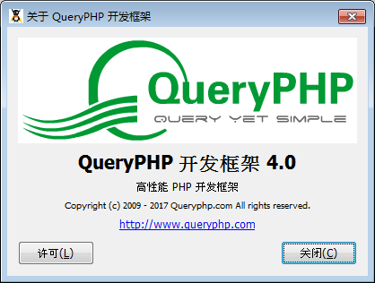

GtkAboutDialog 目的是展示应用程序的相关信息，这方便程序员制作自己的程序关于信息。

关于对话框 GtkAboutDialog 元件提供了一个非常简单的制作程序信息的方法，比如说程序的 logo，名字，版权信息，官方网站和许可协议等等。同时它还可以提供作者列表，文档编写团队，翻译人员以及程序相关的技术文档。一般来说，GtkAboutDialog一般出现菜单栏的“帮助”，它让用户了解程序的相关信息，以方便用户与程序开发者取得联系。

关于对话框经常会提供衔接和Email地址。GtkAboutDialog 将通过 set_email_hook() 和 set_url_hook() 来支持它们。邮件可以采用如下的格式，<user@host>，衔接地址的格式为 http://url ，衔接地址可以有多个，使用空格，tab键或则横线分割。

GtkAboutDialog 的直接父级对象为 GtkDialog，我们可以使用它的构造函数来创建一个对话框实例，并且通过它的相关方法来生成对话框的内容。

我们通过一个例子来给大家展示一下，代码如下：
~~~
<?php   
if(!class_exists('gtk')){   
     die("php-gtk2 模块未安装 \r\n");
}   
  
$dlg = new GtkAboutDialog();   
  
$dlg->set_name('QueryPHP 开发框架');   
$dlg->set_version('4.0');   
  
$dlg->set_comments('高性能 PHP 开发框架');   
$dlg->set_copyright('Copyright (c) 2009 - 2017 Queryphp.com All rights reserved.');   
$dlg->set_license("QueryPHP License:\n\r---------------------------------\n\r商业友好开源");   
  
$logo=GdkPixbuf::new_from_file('logo.png');   
$dlg->set_logo($logo);   
$dlg->set_website('http://www.queryphp.com');   
  
$dlg->run();   
?>  
~~~
效果如下：
