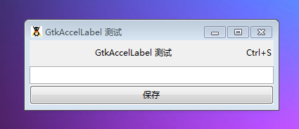

GtkAccelLabel 是一个在文本的右边带有助记键的标签，比如说“Ctrl+S”。GtkAccelLabel 是 GtkLabel的子类。它经常被用于菜单中显示键盘快捷键命令。

助记键的显示不是准确的。取而代之的是， GtkAccelLabel 可以显示通过添加到一个特殊的元件的助记。这个元件可以通过 set_accel_widget()。

比如说，一个 GtkMenuItem元件可以拥有一个当一个用户按下“Ctrl+S”而触发“activate”信号的键助记。一个GtkAccelLabel被创建，然后被添加至GtkMenuItem，使用 set_accel_widget()作为第二个参数来调用 GtkMenuItem。GtkAccelLabel 将会在标签后面显示“Ctrl+S”。

一个 GtkAccelLabel 将会仅仅是按照 Gtk::ACCEL_VISIBLE（可以查看 GtkAccelFlags）显示助记。GtkAccelLabel 可以显示多个助记和信号名字，但是一般来说它常常被用于助记键。

# GtkAccelFlags 详情

|  值  |  符号名称  |  描述  |
| --- | --- | --- |
|   1 |   Gtk::ACCEL_VISIBLE | 显示 GtkAccelLabel?   |
|  ？  |  Gtk::ACCEL_SIGNAL_VISIBLE  |    |
| 2   |  Gtk::ACCEL_LOCKED  |  是否可以被移除？  |
|   7 |  Gtk::ACCEL_MASK	  |    |

# 构造函数
~~~
GtkAccelLabel (string label);   
~~~

创建一个新的带有文本的加速键列表。

最后我们以一个测试程序结束本节教程，代码如下：
~~~
<?php       
if(!class_exists('gtk')){       
    die("php-gtk2 模块未安装 \r\n");       
}   
  
$lbl = new GtkAccelLabel('GtkAccelLabel 测试');   
  
$accgrp = new GtkAccelGroup();   
$btn = new GtkButton('保存');   
  
// 给按钮和分组添加“Ctrl+S”快捷键   
$btn->add_accelerator('activate', $accgrp, Gdk::KEY_S,   
    Gdk::CONTROL_MASK, Gtk::ACCEL_VISIBLE   
);   
  
$lbl->set_accel_widget($btn);   
  
$wnd = new GtkWindow();   
$wnd->add_accel_group($accgrp);   
$wnd->set_title('GtkAccelLabel 测试');   
$wnd->set_default_size(300, -1);   
$wnd->connect_simple('destroy', array('gtk', 'main_quit'));   
  
$vbox = new GtkVBox();   
$vbox->pack_start($lbl);   
$vbox->pack_start(new GtkEntry(), false, false);   
$vbox->pack_start($btn, false, false);   
  
$wnd->add($vbox);   
$wnd->show_all();   
Gtk::main();  
~~~
程序运行效果如下图：
