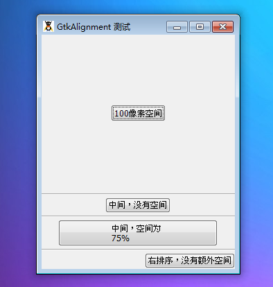

GtkAlignment 是一个控制着它的子元件排列和大小的容器，并且与它自己的尺寸关联。但是，如果子元件拥有一个来自它自己子元素的尺寸，它将优先选择。比如说，一个带有label的GtkButton按钮不会跟label按照比例缩小。

本对话框能够通过xalign和yalign参数用于在容器内定义相对的排列的子元件。两者都只能在0和1之间变化，这意味着left/top和right/bottom。这对于在left或者righ- 排列的GtkLabels非常有用。

GtkAlignment的另一个用处（通过xscale和yscale）是指出容器中的子元素应该占有的额外的空间数量。注意，这不等同于子元件的总尺寸。

GtiAlignment 同时还提供了方法特别设置（相对于当前）元件顶部，底部，右部和左部空隙。

# 它的构造函数为：
~~~
GtkAlignment ([double xalign = 0.5 [, double yalign = 0.5 [, double xscale = 1.0 [, double yscale = 1.0]]]]);  
~~~

# 一个GtkAlignment元件有4个方面的设置：
* xalign：这个参数用于水平放置其子元素。它的值可以为0（左）-1（右）之间的任何数。默认值为0.5，表示子元素相对为GtkAlignment容器的中部。
* yalign：这个参数用于垂直放置其子元素。它的值可以为0（顶）-1（底）之间的任何数。默认值为0.5。
* xscale：它定义了子元素额外占据的GtkAlignment水平空间数量。0意味着子元素没有占用空间，1意味着占据着所有额外的空间。
* yscale：它定义了子元素额外占据的GtkAlignment垂直空间数量。从0（没有占据空间）到1（全局占有）。

我们最后通过一个例子来演示一下，代码如下：
~~~
<?php       
if(!class_exists('gtk')){       
    die("php-gtk2 模块未安装 \r\n"); 
}   
  
// 一个容纳GtkAlignment元件和GtkHSeparators元件的GtkVBox   
$vbox = new GtkVBox();   
  
// 接着偶们创建4个带有不同设置的GtkAlignment容器，每个容器都有1个按钮   
  
// 第一个GtkAlignment容器   
// 它位于左顶部，没有额外空间。   
$align1 = new GtkAlignment(0, 0, 0, 0);   
  
// 我们将一个按钮压入下右边，让空间位于上和左边   
$align1->set_padding(100, 100, 100, 100);   
  
// 创建一个按钮   
$button1 = new GtkButton('100像素空间', false);   
  
// 将按钮1添加至GtkAlignment1容器中   
$align1->add($button1);   
  
// 将GtkAlignment1容器添加至GtkVBox   
$vbox->pack_start($align1, true, true);   
  
// 创建一个分割线   
$vbox->pack_start(new GtkHSeparator(), false, false, 3);   
  
  
// 第二个GtkAlignment容器   
  
// 这个容器将元素居中，并且不允许空间   
$align2 = new GtkAlignment(0.5, 0.5, 0, 0);   
  
// 创建一个按钮   
$button2 = new GtkButton('中间，没有空间');   
  
// 将按钮添加至容器中   
$align2->add($button2);   
  
$vbox->pack_start($align2, true, true);   
  
// 分割线   
$vbox->pack_start(new GtkHSeparator(), false, false, 3);   
  
// 第三个GtkAlignment容器   
  
// 这个容器将子元素居中，留有75%(0.75)的空间。   
$align3 = new GtkAlignment(0.5, 0.5, 0.75, 0.75);   
  
// 创建一个新的按钮   
$button3 = new GtkButton("中间，空间为 \r\n75% ");   
  
// 将按钮添加至第三个GtkAlignment容器   
$align3->add($button3);   
  
// 将GtkAlignment添加GtkVBox   
$vbox->pack_start($align3, true, true);   
  
// 添加一个分割线   
$vbox->pack_start(new GtkHSeparator(), false, false, 3);   
  
// 第4个GtkAlignment容器   
  
// 这个容器右排序它的子元素，没有额外空间   
$align4 = new GtkAlignment(1, 0.5, 0, 0);   
  
// 创建一个新的按钮   
$button4 = new GtkButton("右排序，没有额外空间");   
$align4->add($button4);   
$vbox->pack_start($align4, true, true);   
  
// Window窗口   
$win = new gtkwindow();   
$win->set_position(Gtk::WIN_POS_CENTER);   
$win->set_title('GtkAlignment 测试');   
  
// 将GtkVBox添加至GtkWindow   
$win->add($vbox);   
  
// 连接信号   
$win->connect_simple('destroy',array('gtk','main_quit'));   
  
// 显示内容   
$win->Show_All();   
  
// 主循环   
Gtk::main(); 
~~~  

程序运行效果如下：
