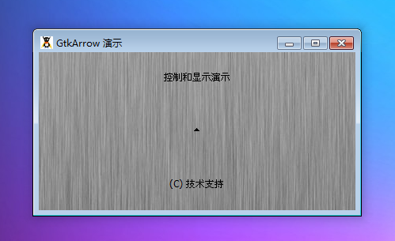

GtkArrow 是显示指向四个基本方向之一的一个箭头元件。GtkArrow 元件可以用来绘制简单的箭头，需要指出的是四个主要方向为上，下，左，右。显示的箭头样式可以被修改，为了满足您的要求，只需要修改参数GtkShadowType和GtkArrowType的值。

GtkArrow 将填补分配给它的任何空间，但是因为它是从GtkMisc继承而来，它可以是填充或者（和）对齐，正好填补空间。

当 GtkArrow被创建后可以使用set() 改变一个箭头的方向或风格。

# 构造函数
~~~
GtkArrow ( GtkArrowType direction , GtkShadowType shadow_type);  
~~~

创建一个指向方向的箭头。shadow_type定义了箭头的外观。GtkArrow 是 GtkMisc的延伸，意味着它是可以填充和对齐，占据尽可能多或尽可能小的空间。默认情况下，一个箭头将扩大和填补为它提供的空间。

# GtkArrowType
用来在一个 GtkArrow中指示指出的方向。

|  值  | 符号名称   | 说明   |
| --- | --- | --- |
| 0   |   Gtk::ARROW_UP |  代表一个向上箭头  |
| 1   |  Gtk::ARROW_DOWN  |  代表一个向下箭头  |
|  2  |  Gtk::ARROW_LEFT  |   代表一个向左箭头 |
| 3   |  Gtk::ARROW_RIGHT  |  代表一个向右  |

# GtkShadowType
用来改变外观的由 GtkFrame 或者 GtkScrolledWindow提供的外围。GtkArrows 同样使用这样的阴影类型。

|  值  |  符号名称  | 说明   |
| --- | --- | --- |
|  0  |  Gtk::SHADOW_NONE  |  没有外围  |
|  1  |  Gtk::SHADOW_IN  |  外围斜面向内  |
|   2 |  Gtk::SHADOW_OUT  | 外围像一个按钮一样斜面向外   |
|   3 |  Gtk::SHADOW_ETCHED_IN  |   外围本身向内斜角，仅框架支持 |
|  4  |  Gtk::SHADOW_ETCHED_OUT  | 外围本身向外斜角，仅框架支   |

我们来测试一段代码结束，代码如下：
~~~
<?php          
if(!class_exists('gtk')){      
    die("php-gtk2 模块未安装 \r\n");       
}      
    
$label1=new GtkLabel('控制和显示演示');   
$label2=new GtkLabel('(C) 技术支持');   
  
$arrow= new GtkArrow(Gtk::ARROW_UP,Gtk::SHADOW_OUT);   
  
$vbox1=new GtkVBox();   
$vbox1->add($label1);   
$vbox1->add($arrow);   
$vbox1->add($label2);   
  
$window1=new GtkWindow();   
$oPixbuf=GdkPixbuf::new_from_file('big.jpg');// 为窗口创建背景   
list($oPixmap,)= $oPixbuf->render_pixmap_and_mask(255);   
$oStyle=$window1->get_style();   
$oStyle=$oStyle->copy();   
$oStyle->bg_pixmap[Gtk::STATE_NORMAL]=$oPixmap;   
$window1->set_style($oStyle);   
$window1->set_title('GtkArrow 演示');   
$window1->set_default_size(400,200);// 窗口大小   
$window1->add($vbox1);   
$window1->connect_simple('destroy',array('Gtk','main_quit'));   
$window1->show_all();   
Gtk::main(); 
~~~

程序运行效果如下：
