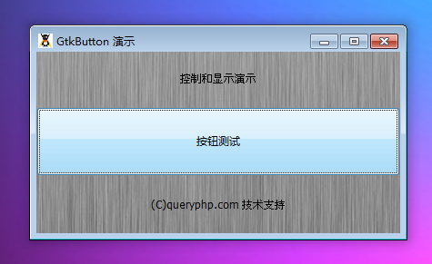

GtkButton 是一个当用户点击发出信号的按钮元件。GtkButton 元件通常被用于显示一个带有文字标签（GtkLabel）的按钮,尽管它可以容纳任何可用的元件。

GtkButton经常被这样使用，当按钮被点击一个回调函数或者方法将会被调用。

# 构造函数
~~~
GtkButton (string label, boolean use_underline);  
~~~

创建一个新的 GtkButton 元件，按钮的内容取决于传递的label和use_underline参数。默认值为null和true。

label标签是按钮中显示的文本。如果你在按钮中需要显示其它的而不仅仅是 GtkLabel的话，那么这个时候你可以创建一个不带任何参数的按钮，然后为按钮添加元件。

如果use_underline的值为true,如果第一个字符被标记,那么这个时候意味着label文字标签中的一个下划线将作为助记符键标记下一个字符。
助记符被用作当一个用户同时按住Alt键的时候按钮的键盘加速器。
~~~
GtkButton::new_from_stock (string stock_id);   
~~~

从系统自带的按钮图标中创建一个按钮。

最后我们以一个测试程序结束本节教程，代码如下：
~~~
<?php       
if(!class_exists('gtk')){       
    die("php-gtk2 模块未安装 \r\n");   
}   
  
$label1=new GtkLabel('控制和显示演示');   
$label2=new GtkLabel('(C)queryphp.com 技术支持');   
  
$button = new GtkButton();   
$button->set_label('按钮测试');   
  
$vbox1=new GtkVBox();   
$vbox1->add($label1);   
$vbox1->add($button);   
$vbox1->add($label2);   
  
$window1=new GtkWindow();   
$oPixbuf=GdkPixbuf::new_from_file('big.jpg');// 为窗口创建背景   
list($oPixmap,)= $oPixbuf->render_pixmap_and_mask(255);   
$oStyle=$window1->get_style();   
$oStyle=$oStyle->copy();   
$oStyle->bg_pixmap[Gtk::STATE_NORMAL]=$oPixmap;   
$window1->set_style($oStyle);   
$window1->set_title('GtkButton 演示');   
$window1->set_default_size(400,200);// 窗口大小   
$window1->add($vbox1);   
$window1->connect_simple('destroy',array('Gtk','main_quit'));   
$window1->show_all();   
Gtk::main();
~~~  

程序运行效果如下图：
