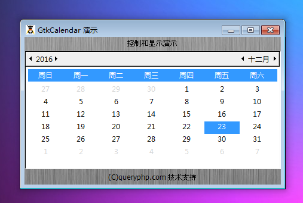

GtkCalendar 是一个显示日历并允许用户选择一个日期的元件。一个 GtkCalendar 是一个网格的日历的元件，每次显示一个月，它允许用户选择特定的日期。

可以使用select_month() 来修改目前显示的月份和年份。可以select_day() 修改当前被选中的确切日期。

你可以使用使用mark_day() 在某一天设置为可视化标记。可以使用unmark_day() 来删除标记。

日历的视觉风格可能会被修改，你可以使用set_display_options()。当然，创建日历本身的目的是要获取来自用户的输入,你可以使用get_date() 获取由用户选择的日期。

# 构造函数
~~~
GtkCalendar ();  
~~~

创建一个设置为显示当前的月份和年份的日历元件。

我们来一段测试程序，代码如下：
~~~
<?php          
if(!class_exists('gtk')){      
    die("php-gtk2 模块未安装 \r\n");   
}      
    
$label1=new GtkLabel('控制和显示演示');   
$label2=new GtkLabel('(C)queryphp.com 技术支持');   
  
$calendar= new GtkCalendar();   
  
$vbox1=new GtkVBox();   
$vbox1->add($label1);   
$vbox1->add($calendar);   
$vbox1->add($label2);   
  
$window1=new GtkWindow();   
$oPixbuf=GdkPixbuf::new_from_file('big.jpg');// 为窗口创建背景   
list($oPixmap,)= $oPixbuf->render_pixmap_and_mask(255);   
$oStyle=$window1->get_style();   
$oStyle=$oStyle->copy();   
$oStyle->bg_pixmap[Gtk::STATE_NORMAL]=$oPixmap;   
$window1->set_style($oStyle);   
$window1->set_title('GtkCalendar 演示');   
$window1->set_default_size(400,200);// 窗口大小   
$window1->add($vbox1);   
$window1->connect_simple('destroy',array('Gtk','main_quit'));   
$window1->show_all();   
Gtk::main();  
~~~

程序运行效果如下：
