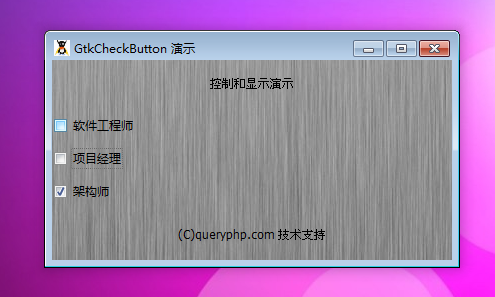

GtkCheckButton 是一个显示复选按钮的元件，它是一个非常常见带有标签的元件。它经常被用于获取用户输入（就像一个按钮一样）。它其实是一个GtkToggleButton 挨着另一个元件（一般来说为挨着一个 GtkLabel），但是却有一个选中标记代表着是否处于选中状态。

一组复选按钮通常被用于让用户选中零个或者多个给予的选项。值得注意的是这个元件像 GtkToggleButton 一样。

# 构造函数
~~~
GtkCheckButton ([string label = null [, bool use_underline = false]]);  
~~~

使用构造函数创建一个新的复选按钮。你可以通过第一个参数传递一个挨着点击按钮的标签。同时，第二个参数如果为true的话，那么标签将会带有助记符。

这个类是衍生的，因此它表现得像 GtkToggleButton。你可以使用信号"toggled"来获取复选按钮的状态改变。

最后我们以一个测试程序结束本节教程，代码如下：
~~~
<?php       
if(!class_exists('gtk')){       
   die("php-gtk2 模块未安装 \r\n");
}   
  
$label1=new GtkLabel('控制和显示演示');   
$label2=new GtkLabel('(C)queryphp.com 技术支持');   
  
$checkbtn1 = new GtkCheckButton('软件工程师');   
$checkbtn2 = new GtkCheckButton('项目经理');   
$checkbtn3 = new GtkCheckButton('架构师');   
$checkbtn3->set_active(true);   
$vbox2=new GtkVBox();   
$vbox2->add($checkbtn1);   
$vbox2->add($checkbtn2);   
$vbox2->add($checkbtn3);   
  
$vbox1=new GtkVBox();   
$vbox1->add($label1);   
$vbox1->add($vbox2);   
$vbox1->add($label2);   
  
$window1=new GtkWindow();   
$oPixbuf=GdkPixbuf::new_from_file('big.jpg');// 为窗口创建背景   
list($oPixmap,)= $oPixbuf->render_pixmap_and_mask(255);   
$oStyle=$window1->get_style();   
$oStyle=$oStyle->copy();   
$oStyle->bg_pixmap[Gtk::STATE_NORMAL]=$oPixmap;   
$window1->set_style($oStyle);   
$window1->set_title('GtkCheckButton 演示');   
$window1->set_default_size(400,200);// 窗口大小   
$window1->add($vbox1);   
$window1->connect_simple('destroy',array('Gtk','main_quit'));   
$window1->show_all();   
Gtk::main(); 
~~~ 

程序运行效果如下图：
