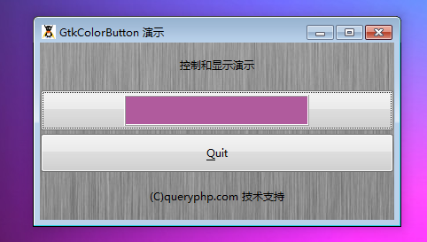

GtkColorButton 是一个能够根据对话框选择一种颜色的按钮。GtkColorButton 是一个拥有两个方面功能的按钮。第一个就是显示当前的选择的颜色（或者还有选择为默认的颜色），另一个就是让用户加载 GtkColorSelectionDialog 对话框来选择一个颜色。如果当你出于某个方面的目的需要选择一种颜色的时候，它将变得非常有用。

# 构造函数
~~~
GtkColorButton ();   
~~~

创建一个新的 GtkColorButton。GtkColorButton 包含一个小的区域用于显示颜色，点击它将允许通过一个对话框选择一种颜色。这一块小区域将会在用户选择颜色完成后及时更新。

最后我们以一个测试程序结束本节教程，代码如下：
~~~
<?php       
if(!class_exists('gtk')){       
    die("php-gtk2 模块未安装 \r\n");       
}   
  
$window1=new GtkWindow();   
  
$label1=new GtkLabel('控制和显示演示');   
$label2=new GtkLabel('(C)queryphp.com 技术支持');   
  
$thebutton = new GtkColorButton();   
  
$toquit = new GtkButton('_Quit');   
$toquit->connect_simple(   
    'clicked',   
    array($window1, 'destroy')   
);   
  
$thevbox = new GtkVBox();   
$thevbox->pack_start($thebutton);   
$thevbox->pack_start($toquit);   
  
$vbox1=new GtkVBox();   
$vbox1->add($label1);   
$vbox1->add($thevbox);   
$vbox1->add($label2);   
  
  
$oPixbuf=GdkPixbuf::new_from_file('big.jpg');// 为窗口创建背景   
list($oPixmap,)= $oPixbuf->render_pixmap_and_mask(255);   
$oStyle=$window1->get_style();   
$oStyle=$oStyle->copy();   
$oStyle->bg_pixmap[Gtk::STATE_NORMAL]=$oPixmap;   
$window1->set_style($oStyle);   
$window1->set_title('GtkColorButton 演示');   
$window1->set_default_size(400,200);// 窗口大小   
$window1->add($vbox1);   
$window1->connect_simple('destroy',array('Gtk','main_quit'));   
$window1->show_all();   
Gtk::main();
~~~  

程序运行效果如下图：
