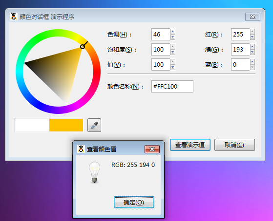

GtkColorSelectionDialog 颜色对话框是一个分离的颜色选择器。本对话框继承至GtkColorSelection元件，它允许用户获取一个颜色值。

颜色对话框的构造函数为 GtkColorSelectionDialog ([string title = null])，通过它可以创建一个非常漂亮的颜色对话框实例，并且可以通过它的方法改变部分属性。

最后以一个演示程序结束本次教程，代码如下：
~~~
<?php   
if(!class_exists('gtk')){   
     die("php-gtk2 模块未安装 \r\n");
}   
  
// 创建演示对话框   
$dlgColorsel = new GtkColorSelectionDialog('颜色对话框 演示程序');   
$dlgColorsel->connect_simple('destroy', array('gtk', 'main_quit'));// 为关闭窗口创建信号   
$dlgColorsel->cancel_button->connect_simple('clicked', array($dlgColorsel, 'destroy'));// 销毁取消按钮   
  
// 确认按钮   
$dlgColorsel->ok_button->set_label('查看演示值');   
$dlgColorsel->ok_button->connect('clicked', 'showTheColor');   
  
// 创建对话框中说明信息   
$label1=new GtkLabel();   
$label1->set_label("关于颜色对话框");   
$label1->set_alignment(0.5, 0.5);   
$label1->set_padding(0, 0);   
$label1->set_visible(true, false);   
  
$label2=new GtkLabel();   
$label2->set_label("颜色对话框可以非常方便地从系统调出一个非常漂亮的颜色选择框");   
$label2->set_alignment(0.5, 0.5);   
$label2->set_padding(0, 0);   
$label2->set_visible(true, false);   
  
$dlgColorsel->vbox->add($label1);   
$dlgColorsel->vbox->add($label2);   
  
// 隐藏帮助按钮   
$dlgColorsel->help_button->hide();   
  
function showTheColor($button){   
$dlgColorsel = $button->get_toplevel();// 返回上层，即对话框本身   
$color = $dlgColorsel->colorsel->get_current_color();// 返回Gdkcolor   
// GdkColor有48位深度(R, B 和 G 各16位)，我们只需要8位，我们这里转化8位   
$strColor='RGB: '.($color->red>>8).' '.($color->green>>8).' '.($color->blue>>8);   
$msg = new GtkMessageDialog(null,0,Gtk::MESSAGE_INFO,Gtk::BUTTONS_OK,$strColor);   
$msg->set_title('查看颜色值');   
$msg->run();   
$msg->destroy();   
}   
  
// 显示对话框   
$dlgColorsel->show();   
  
// 开始主循环   
Gtk::main();   
  
?>  
~~~
运行效果如下，如下图：
