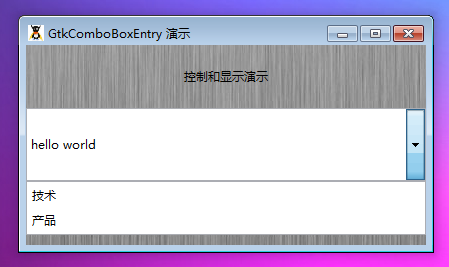

GtkComboBoxEntry 是一个带有预定的下拉值的输入文本域组合框。这个元件和 GtkComboBox 非常相似，只是它允许用户编辑或者输入一个值而不是从列表中直接选择。可以在 GtkEntry中显示选择的值，这样用户可以编辑它或者创建一个新的值。

就像 GtkComboBox，这个元件需要一个适合的模型，或者使用new_text构造函数来生成。如果你使用一个模型，你的模型必须拥有一个文本列，这个文本列可以通过 set_text_column()方法来做到。

你可以使用 get_active_text方法来取得文本域中的字符串。

# 构造函数
~~~
GtkComboBoxEntry ([GtkTreeModelmodel = null]);  
~~~

使用这个构造函数创建一个基本的 GtkComboBoxEntry 元件。在使用完构造函数后，你应该使用set_model来设置模型。另一种方法可以通过构造函数的参数来传递一个模型。这个模型必须包含一个文本列，你可以使用set_text_column()来完成设置。
~~~
GtkComboBoxEntry::new_text (); 
~~~

这个事一个非常便捷的创建仅仅用于显示文本的 GtkComboBoxEntry的构造函数。如果你使用它创建这个元件，你可以使用app_text,insert_text,prepend_text和remove_text来选择。
~~~
GtkComboBoxEntry::new_with_model (model, text_column);  
~~~

基本同上上，这个函数只能静态调用。

我们来一段测试程序，代码如下：
~~~
<?php          
if(!class_exists('gtk')){      
    die("php-gtk2 模块未安装 \r\n");      
}      
    
$label1=new GtkLabel('控制和显示演示');   
$label2=new GtkLabel('(C)queryphp.com 技术支持');   
  
$comboentry = GtkComboBoxEntry::new_text();   
$comboentry->append_text('技术');   
$comboentry->append_text('产品');   
  
$vbox1=new GtkVBox();   
$vbox1->add($label1);   
$vbox1->add($comboentry);   
$vbox1->add($label2);   
  
$window1=new GtkWindow();   
$oPixbuf=GdkPixbuf::new_from_file('big.jpg');// 为窗口创建背景   
list($oPixmap,)= $oPixbuf->render_pixmap_and_mask(255);   
$oStyle=$window1->get_style();   
$oStyle=$oStyle->copy();   
$oStyle->bg_pixmap[Gtk::STATE_NORMAL]=$oPixmap;   
$window1->set_style($oStyle);   
$window1->set_title('GtkComboBoxEntry 演示');   
$window1->set_default_size(400,200);// 窗口大小   
$window1->add($vbox1);   
$window1->connect_simple('destroy',array('Gtk','main_quit'));   
$window1->show_all();   
Gtk::main(); 
~~~ 

程序运行效果如下：
