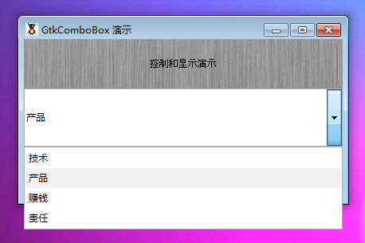

GtkComboBox 是一个用于从一个项目列表中选取一个值。GtkComboBox 是 GtkOptionMenu和GtkCombo元件的替代品，它提供了一个让用户从一个列表项中选择一个值的解决方法。

GtkComboBox 继承至 GtkCellLayout 接口，它提供了一定数量的有用方法通过model-view 部分来管理内容。它的构造函数可以传递一个 GtkTreeModel，这个也可以通过后面的set_model()方法来添加。

当然还有另一种选择，new_text函数会创建一个简单的 GtkComboBox和与之关联的GtkListStore 模型。一个 GtkCellRendererText同样被创建和大包到新的组合框中。在这个简单的组合框中，每一个项都是一个可以选择的文本。接下来的这些方法 append_text(),prepend_text(),insert_text()和remove_text()方法可以被用于管理 GtkComboBox的内容。

# 构造函数
~~~
GtkComboBox (GtkTreeModel model);  
~~~

创建一个新的 带有一个与之关联的指定的 GtkTreeModel 模型GtkComboBox。如果模型不是组合框指定的类型，那么这个时候树模型并不会与之关联。
~~~
GtkComboBox::new_text ();  
~~~

new_text是一个非常便利的通过构造函数创建一个新的组合框的方法，这个GtkComboBox仅仅显示字符串。如果你使用这个方法来创建一个文本组合框，你应该使用如下的方法append_text(),prepend_text(),prepend_text(),insert_text()和remove_text()来管理其数据项。

这里我们测试一下这个元件，代码如下：
~~~
<?php          
if(!class_exists('gtk')){      
    die("php-gtk2 模块未安装 \r\n");   
}     
  
$label1=new GtkLabel('控制和显示演示');   
$label2=new GtkLabel('(C)queryphp.com 技术支持');   
  
$combo = new GtkComboBox();   
  
$listStore = new GtkListStore(GObject::TYPE_STRING);   
$listStore->append(array('技术'));   
$listStore->append(array('产品'));   
$listStore->append(array('赚钱'));   
$listStore->append(array('责任'));   
  
$combo->set_model($listStore);   
$cellRenderer = new GtkCellRendererText();   
$combo->pack_start($cellRenderer);   
$combo->set_attributes($cellRenderer, 'text', 0);   
  
$vbox1=new GtkVBox();   
$vbox1->add($label1);   
$vbox1->add($combo);   
$vbox1->add($label2);   
  
$window1=new GtkWindow();   
$oPixbuf=GdkPixbuf::new_from_file('big.jpg');// 为窗口创建背景   
list($oPixmap,)= $oPixbuf->render_pixmap_and_mask(255);   
$oStyle=$window1->get_style();   
$oStyle=$oStyle->copy();   
$oStyle->bg_pixmap[Gtk::STATE_NORMAL]=$oPixmap;   
$window1->set_style($oStyle);   
$window1->set_title('GtkComboBox 演示');   
$window1->set_default_size(400,200);// 窗口大小   
$window1->add($vbox1);   
$window1->connect_simple('destroy',array('Gtk','main_quit'));   
$window1->show_all();   
Gtk::main();
~~~  

程序运行效果如下：
