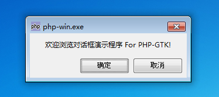
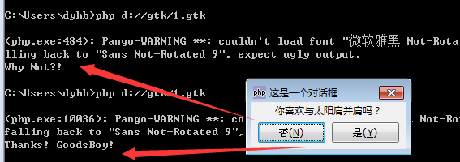

GtkDialog 是一个弹窗，这跟我们Javascript中alert那些窗口时一个类型的，它是GtkWindow的一个直接子类。我们名字我们可以猜出，对话框是一个非常有用的与用户交互的元件。举个例子来说，你也许会向用户提出一个问题，或者带有多个表单的提示prompt，以及一些动作的确认confirm，大家做WEB的时候也搞过这些吧。对话框主要是帮助比如像是提供一个交互的适当的窗口。

一个GtkDialog 由两个区域组成，你可以在顶部区域插入GtkLabel文本或者GtkEnter文本框。底部区域可以用于存放能够进行一些操作的GtkButtons按钮，比如说确认或者取消，这里可以存放多个按钮。顶部区域对应于GtkDialog对象的vbox属性，vbox属性是一个GtkVBox对象实例，底部对应于action_area属性。

一般来说创建对话框的过程为使用对话框GtkDialog的构造函数创建一个实例，接着添加一些合适的元件到action_area和vbox。你可以使用add_button()方法将需要的按钮添加到action_area。这个方法的高级之处允许你创建某种目的的按钮。你可以从GtkResponseType中找到，这表明你按钮是做什么的。最方便的添加按钮的方法是通过构造函数的第三个参通过add_buttons方法传入按钮。

# GtkResponseType 枚举类型
这里列出了使用add_button添加按钮，各种不同的用户的按钮。

|  值  |  符号名称  |  描述  |
| --- | --- | --- |
| -11  |  Gtk::RESPONSE_HELP  |  在GTK+ 对话框中提供一个帮助Help按钮  |
| -10   | Gtk::RESPONSE_APPLY   | 在GTK+ 对话框中提供一个Apply按钮   |
|  -9  | Gtk::RESPONSE_NO   |  在GTK+ 对话框中提供一个No按钮  |
|  -8  | Gtk::RESPONSE_YES   |  在GTK+ 对话框中提供一个Yes按钮  |
|  -7  |  Gtk::RESPONSE_CLOSE  |  在GTK+ 对话框中提供一个关闭Close按钮  |
|  -6  |  Gtk::RESPONSE_CANCEL  |  在GTK+ 对话框中提供一个取消Cancel按钮  |
|  -5  | Gtk::RESPONSE_OK   |  在GTK+ 对话框中提供一个OK按钮  |
|  -4  | Gtk::RESPONSE_DELETE_EVENT   |  在GTK+ 对话框中提供一个if按钮  |
|  -3  |  Gtk::RESPONSE_ACCEPT  |   非GTK+ 对话框中普通响应ID  |
|  -2  |  Gtk::RESPONSE_REJECT  |  非GTK+ 对话框中普通响应ID  |
|  -1  |  Gtk::RESPONSE_NONE  | 如果一个按钮没有响应ID或者对话框被程序隐藏了或者销毁了   |

# 对话框的构造函数如下：
~~~
GtkDialog ([string title = null [, GtkWidget parent_window = null [, GtkDialogFlags dialog_flags = 0 [, array(GtkButton, GtkResponseType)]]]]);  
~~~

构造函数就是创建一个GtkDialog对话实例，第一个是对话框的标题，第二个父级对话框，第三个是对话框类型（3个类型），传入的按钮类型。

# GtkDialogFlags 枚举类型
|  值  |  符号名称  |  描述  |
| --- | --- | --- |
| 1   |  Gtk::DIALOG_MODAL  |  设置窗口模态，可以通过set_modal方法达到同样的效果  |
| 2   |  Gtk::DIALOG_DESTROY_WITH_PARENT  |  设置父级窗口被销毁时，这个子窗口是否被同时销毁，大家可以查看 set_destroy_with_parent()  |
|  4  |  Gtk::DIALOG_NO_SEPARATOR  | 不在action area和对话框内容之间设置一个分割   |

大多数情况来说，除非你想要创建一个高度自定义的对话框，你才需要深入。而且，像GtkFileChooserDialog 文件选择对话框和GtkColorSelectionDialog颜色对话框已经被系统提供了。

下面举几个例子来说明一下：

# 例 1.0：一个普通的对话框
~~~
<?php   
if(!class_exists('gtk')){   
	die("php-gtk2 模块未安装 \r\n");   
}   
  
$dialog1=new GtkDialog();   
$dialog1->set_position(Gtk::WIN_POS_CENTER_ON_PARENT);   
$dialog1->set_type_hint(Gdk::WINDOW_TYPE_HINT_DIALOG);   
  
// 创建按钮   
$button1=new GtkButton();   
$button1->set_label('确定');   
$button1->set_visible(true, false);   
$button2=new GtkButton();   
$button2->set_label('取消');   
$button2->set_visible(true, false);   
  
// 创建欢迎文字   
$label1=new GtkLabel();   
$label1->set_label("欢迎浏览对话框演示程序 For PHP-GTK!");   
$label1->set_alignment(0.5, 0.5);   
$label1->set_padding(0, 0);   
$label1->set_visible(true, false);   
  
$dialog1->vbox->add($label1);   
$dialog1->add_action_widget($button1,0);   
$dialog1->add_action_widget($button2,0);   
  
$dialog1->set_has_separator(false);   
$dialog1->show_all();   
  
// 开始主循环   
Gtk::main();   
?>  
~~~
程序运行效果如下：

# 例 2.0 使用 Dialog创建一个消息框
~~~
<?php   
if(!class_exists('gtk')){   
	die("php-gtk2 模块未安装\r\n");   
}   
  
$dialogBox = new GtkDialog("这是一个对话框",NULL,Gtk::DIALOG_MODAL,array(Gtk::STOCK_NO,Gtk::RESPONSE_NO,Gtk::STOCK_YES,Gtk::RESPONSE_YES));   
  
$dialogQues = new GtkLabel("你喜欢与太阳肩并肩吗？");   
$dialogBox->vbox->add($dialogQues);   
  
$dialogBox->show_all();   
  
$result = $dialogBox->run();   
switch($result) {   
      case (Gtk::RESPONSE_YES):   
     		 echo "Thanks! GoodsBoy!\n";   
      break;   
      case (Gtk::RESPONSE_NO):   
      		 echo "Why Not?!\n";   
      break;   
}   
  
$dialogBox->destroy();   
?>  
~~~
运行效果如下，我们分别点击按钮，请忽略警告不影响使用：
