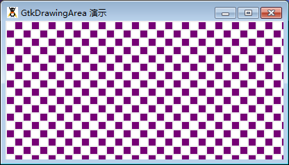

GtkDrawingArea 是一个用于创建自定义用户界面元素的元件。这个元件初始化是一个空白的元件，可以在其上通过访问其窗口的区域来绘制图像，这是一个GdkWindow。您可以使用该元件绘制自定义模式或者像涂鸦这样的互动程序。

有三个重要的GtkWindow类的信号，对于这个元件特别有用。realize 信号用于在一个特定的显示的时候采取必要的动作，configure-event 信号用于当元件改变大小的时候定义发生了什么，最后的是expose-event 信号将允许你处理重绘绘图区域中的内容。

当绘图区域第一次出现在屏幕上，同时当元件被另一个窗口覆盖的时候和后来获取，一个 expose 事件同样也会发生。你将最有可能使用GdkWindow 的绘图方法绘制图纸区域。

为了捕获鼠标在绘图区域的事件，你必须使用add_events()。

请避免使用绘图区域，除非你真的需要它的灵活性，伴随而来的是巨大的复杂性。你将工作Gdk 层上，而不是在 GTK层的时候，请使用这个小工具。大多数时候，可以使用 GtkImage 元件是一个更加容易替代 GtkDrawingArea 的元件。

# 构造函数
~~~
GtkDrawingArea ();  
~~~

使用构造函数来创建一个新的空绘图区元件。在下面的例子中，我们使用“expose-event”事件来创建一个简单的棋盘。值得注意的是，在实际应用中，我们可以通过 GtkImage来达到同样的效果，而且更加容易。

我们来测试一段代码结束，代码如下：
~~~
<?php          
if(!class_exists('gtk')){      
    die("php-gtk2 模块未安装 \r\n");    
}      
    
define("SIZE", 10);   
define("SPACING", 2);   
  
function doExpose($widget, $event){   
    // 红白   
    $color1 = new GdkColor(30000, 0, 30000);   
    $color2 = new GdkColor(65535, 65535, 65535);   
  
    // 一个红色框的图形上下文   
    $gc1 = new GdkGC($widget->window);   
    $gc1->set_rgb_fg_color($color1);   
  
    // 一个白色框的图形上下文   
    $gc2 = new GdkGC($widget->window);   
    $gc2->set_rgb_fg_color($color2);   
  
    $xcount = 0;   
    $x = SPACING;   
  
    while ($x < $widget->allocation->width){   
        $y = SPACING;   
        $ycount = $xcount % 2;   
  
        // 遍历行   
        while ($y < $widget->allocation->height){   
            if ($ycount % 2) {   
                $gc = $gc1;   
            } else {   
                $gc = $gc2;   
            }   
            $widget->window->draw_rectangle($gc, true, $x, $y, SIZE, SIZE);   
            $y += SIZE + SPACING;   
            ++$ycount;   
        }   
  
        // 下一列   
        $x += SIZE + SPACING;   
        ++$xcount;   
    }   
    return true;   
}   
  
$win = new GtkWindow();   
$dra = new GtkDrawingArea();   
  
$dra->connect('expose-event', 'doExpose');   
$win->connect_simple('destroy', array('Gtk', 'main_quit'));   
  
$win->set_title('GtkDrawingArea 演示');   
$win->add($dra);   
$win->set_size_request(400,200);   
$win->show_all();   
  
Gtk::main();
~~~  

程序运行效果如下：
