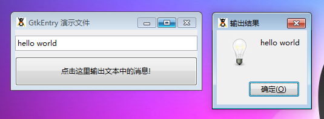

GtkEntry 是一个输入文本域。它通常被用于捕获用户输入。系统支持相当数量的键绑定设置和用户编辑的能力。如果输入文本域中文字比元件的配置更长，然后元件可以滚动以便于让当前位置可以看见。

# 构造函数
~~~
GtkEntry ([ string text [, int max ]]); 
~~~
 
创建一个hold得住文字的文本域。你可以使用 set_text()或者用户输入来设置文本。

如果文本被设置，这将会是元件的默认值。如果最大值被设置，它将会允许最大的字符数。

最后我们以一个测试程序结束本节教程，代码如下：
~~~
<?php       
if(!class_exists('gtk')){       
    die("php-gtk2 模块未安装 \r\n");   
}   
  
function get_input($entry) {   
    $input = $entry->get_text();   
    $dialog = new GtkMessageDialog($wnd, Gtk::DIALOG_MODAL,Gtk::MESSAGE_INFO, Gtk::BUTTONS_OK, $errors);   
    $dialog->set_markup("$input\r\n");      
    $dialog->set_title('输出结果');   
    $dialog->run();      
    $dialog->destroy();   
    $entry->grab_focus();   
    $entry->set_text("");   
}   
  
$window = new GtkWindow();   
$window->set_title('GtkEntry 演示文件');   
$window->set_position(Gtk::WIN_POS_CENTER);   
$window->set_default_size(300,80);   
$window->connect_simple('destroy', array('Gtk', 'main_quit'));   
  
$box = new GtkVBox();   
$window->add($box);   
  
$entry = new GtkEntry();   
$entry->grab_focus();
$entry->connect('activate', 'get_input');   
$box->add($entry);   
  
$button = new GtkButton('点击这里输出文本中的消息!');   
$button->connect_simple('clicked', 'get_input', $entry);   
$box->add($button);   
  
$window->show_all();   
Gtk::main(); 
~~~ 

程序运行效果如下图：
