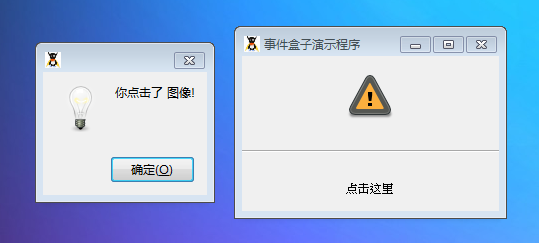

GtkEventBox 经常被用于捕获事件。这个类的目的为一些没有自己事件句柄功能的元件去接受和响应用户输入。

最普遍的使用地方为应用程序在图像方法。有的时候，你也许在你的应用程序上显示了一张图像，而且你需要让图像接受事件。GtkEventBox 可以帮助你完成上述功能。当然，你可以在任何没有自己的窗口的元件上使用这个类。

这个类是 GtkBin的子类，因此它拥有自己的窗口。

# 构造函数
~~~
GtkEventBox ();  
~~~

创建一个新的事件盒子实例。

最后我们以一段测试程序结束，代码如下：
~~~
<?php       
if(!class_exists('gtk')){       
    die("php-gtk2 模块未安装 \r\n");     
}   
  
// 创建图像到 GtkEventBox   
$imageEvent = new GtkEventBox();   
$imageWidget = GtkImage::new_from_stock(   
    Gtk::STOCK_DIALOG_WARNING,   
    Gtk::ICON_SIZE_DIALOG   
);   
$imageEvent->add($imageWidget);   
  
// 创建文字到 GtkEventBox   
$labelEvent = new GtkEventBox();   
$labelWidget = new GtkLabel('点击这里');   
$labelEvent->add($labelWidget);   
  
// 连接信号   
$imageEvent->connect('button_press_event', 'doSomething');   
$labelEvent->connect('button_press_event', 'doSomething');   
  
function doSomething($widget, $event){   
    $widget = $widget->get_child()->get_name();   
    if ($widget == 'GtkImage') {   
        $type = '图像';   
    } else {   
        $type = '文字标签';   
    }   
  
    $dialog = new GtkMessageDialog(   
        null,   
        0,   
        Gtk::MESSAGE_INFO,   
        Gtk::BUTTONS_OK,   
        '你点击了 ' . $type . '!'   
    );   
    $dialog->run();   
    $dialog->destroy();   
}   
  
// 创建 GtkVBox存放元件   
$vbox = new GtkVBox();   
$seperator = new GtkHSeparator();   
$vbox->pack_start($imageEvent);   
$vbox->pack_start($seperator);   
$vbox->pack_start($labelEvent);   
  
// 添加 GtkVBox 显示出来   
$window = new GtkWindow();   
$window->add($vbox);   
$window->set_position(Gtk::WIN_POS_CENTER);   
$window->set_default_size(200,150);   
$window->show_all();   
$window->set_title("事件盒子演示程序");   
$window->connect_simple('destroy',array('Gtk', 'main_quit'));   
Gtk::main();  
~~~

程序运行效果如下图：
