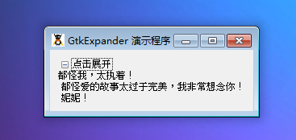

GtkExpander 是一个可以隐藏它的元件的容器。GtkExpander 可以创建一个容器能够隐藏和根据显示细节。我们可以通过一个小的可以点击的三角（跟前边的GtkTreeView相似）来控制细节是否被显示。如果三角被点击向右边，细节被隐藏。当点击对象，细节就会立刻被显示出来。

你可以像其它 GtkBin的子类一样使用 GtkExpander,首先你需要创建子元件，然后使用add()将子元件添加至展开器。

# 构造函数
~~~
GtkExpander (string label);  
~~~

创建一个展开器对象。
~~~
GtkExpander::new_with_mnemonic (string label);   
~~~

创建一个带有助记符标签的 GtkExpander 对象实例。

最后来一段测试结束，代码如下：
~~~
<?php       
if(!class_exists('gtk')){       
    die("php-gtk2 模块未安装 \r\n");     
}   
  
function onDestroy(){   
    Gtk::main_quit();   
}   
  
// 创建窗口   
$window = new GtkWindow();   
$window->connect('destroy', 'onDestroy');   
$window->set_title('GtkExpander 演示程序');   
$window->set_default_size(250, 60);   
$window->set_border_width(10);   
  
$expander =  new GtkExpander('点击展开');   
$label = new GtkLabel("都怪我，太执着！\r\n 都怪爱的故事太过于完美，我非常想念你！\r\n 妮妮！");   
$expander->add($label);   
  
$window->add($expander);   
$window->show_all();   
Gtk::main();  
~~~

程序运行效果如下图：
