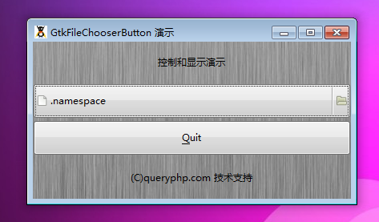

GtkFileChooserButton 是一个允许选择一个文件的按钮。GtkFileChooserButton 跟GtkColorButton 按钮十分相似。它是一个非常好用的允许用户选择一个文件的按钮。

这个按钮包含一个显示当前选择文件的文件名，同时它也会显示一个按钮让用户通过一个对话框选中一个文件。当对话框加载后，按钮将会显示用户新选择的文件。

GtkFileChooserButton 仅仅可以被用于选择文件夹和文件。它不能用于保持文件。

# 构造函数
~~~
GtkFileChooserButton (string title, GtkFileChooserAction action);  
~~~

# 创建一个新的文件选择按钮
~~~
GtkFileChooserButton::new_with_backend (title, action, backend);   
~~~

# 同上
~~~
GtkFileChooserButton::new_with_dialog (GtkWidgetdialog);   
~~~

最后我们以一个测试程序结束本节教程，代码如下：
~~~
<?php       
if(!class_exists('gtk')){       
    die("php-gtk2 模块未安装 \r\n");       
}   
  
$window1=new GtkWindow();   
  
$label1=new GtkLabel('控制和显示演示');   
$label2=new GtkLabel('(C)queryphp.com 技术支持');   
  
$thebutton = new GtkFileChooserButton(   
    'Select the File',   
    Gtk::FILE_CHOOSER_ACTION_OPEN   
);   
  
$toquit = new GtkButton('_Quit');   
$toquit->connect_simple(   
    'clicked',   
    array($window1, 'destroy')   
);   
  
$thevbox = new GtkVBox();   
$thevbox->pack_start($thebutton);   
$thevbox->pack_start($toquit);   
  
$vbox1=new GtkVBox();   
$vbox1->add($label1);   
$vbox1->add($thevbox);   
$vbox1->add($label2);   
  
  
$oPixbuf=GdkPixbuf::new_from_file('big.jpg');// 为窗口创建背景   
list($oPixmap,)= $oPixbuf->render_pixmap_and_mask(255);   
$oStyle=$window1->get_style();   
$oStyle=$oStyle->copy();   
$oStyle->bg_pixmap[Gtk::STATE_NORMAL]=$oPixmap;   
$window1->set_style($oStyle);   
$window1->set_title('GtkFileChooserButton 演示');   
$window1->set_default_size(400,200);// 窗口大小   
$window1->add($vbox1);   
$window1->connect_simple('destroy',array('Gtk','main_quit'));   
$window1->show_all();   
Gtk::main();  
~~~

程序运行效果如下图：
