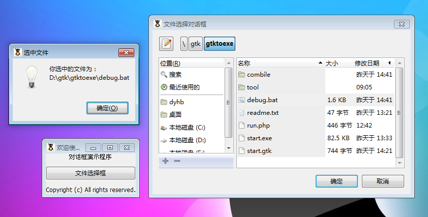

GtkFileChooserDialog 是一个文件选择对话框，它允许用户选择一个文件。这个对话框继承至GtkFileChooser元件，它让用户找到一个特定的文件。

> 注意：这个元件没有自己的方法，直接找它的父类查看相关方法。

我们写了一个测试程序试试，代码如下：
<?php   
if(!class_exists('gtk')){   
    die("php-gtk2 模块未安装 \r\n");
}   
  
$window1=new GtkWindow();   
$window1->set_title('欢迎使用文件选择');   
$window1->connect_simple('destroy', array('gtk', 'main_quit'));   
  
function showChooseFile($button){   
      $filechooserdialog1=new GtkFileChooserDialog();   
      $filechooserdialog1->set_title('文件选择对话框');   
      $filechooserdialog1->set_position(Gtk::WIN_POS_CENTER_ON_PARENT);   
      $filechooserdialog1->set_type_hint(Gdk::WINDOW_TYPE_HINT_DIALOG);   
      $filechooserdialog1->set_has_separator(false);   

      $label1=new GtkLabel();   
      $label1->set_label("欢迎使用文件选择器");   
      $label1->set_alignment(0.5, 0.5);   
      $label1->set_padding(0, 0);   
      $label1->set_visible(true, false);   
      $filechooserdialog1->vbox->add($label1);   
      $wndBtnOk=$filechooserdialog1->add_button('确定',Gtk::RESPONSE_OK);   
      $filechooserdialog1->add_button('取消',Gtk::RESPONSE_CANCEL);   
      $filechooserdialog1->connect('response','onResponse');// 事件   
      $wndBtnOk->connect('clicked','onOk');   

      $filechooserdialog1->show();   
}   
  
function onResponse(GtkDialog $wndDialog,$nResponse){   
      switch($nResponse){   
         case Gtk::RESPONSE_OK :   
              onOk(null,$wndDialog);   
             break;   
         case Gtk::RESPONSE_CANCEL :   
             $wndDialog->destroy();   
      }   
}   
  
function onOk(GtkButton $okButton=null,$mainDialog=null){   
      if($okButton!==null){   
         $mainDialog=$okButton->get_toplevel();   
      }   
      
      $nAction=$mainDialog->get_action();   
      if(Gtk::FILE_CHOOSER_ACTION_OPEN===$nAction){   
          $arrFileDirs=$mainDialog->get_filenames();   
            if(count($arrFileDirs)){   
                  $sFile=$mainDialog->get_filename();   
                  $msg = new GtkMessageDialog(null,0,Gtk::MESSAGE_INFO,Gtk::BUTTONS_OK,"你选中的文件为：\r\n".$sFile); 
                  $msg->set_title('选中文件');   
                  $msg->run();   
                  $msg->destroy();   
                  $mainDialog->destroy();   
            }   
            else{   
                return false;   
            }   
      }  else{   
            echo "to do nothing!\n\r";   
            return false;   
      }   
}   
  
$vbox1=new GtkVBox();   
$vbox1->set_homogeneous(false);   
$vbox1->set_spacing(10);   
$window1->add($vbox1);   
  
$label1=new GtkLabel();   
$label1->set_label("Copyright (c) All rights reserved.");   
$label1->set_alignment(0.5, 0.5);   
$label1->set_padding(0, 0);   
$label1->set_visible(true, false);   
  
$label2=new GtkLabel();   
$label2->set_label("对话框演示程序");   
$label2->set_alignment(0.5, 0.5);   
$label2->set_padding(0, 0);   
$label2->set_visible(true, false);   
  
$button1=new GtkButton();
$button1->set_label('文件选择框');   
$button1->set_visible(true, false);   
$button1->connect('clicked','showChooseFile');   
  
$vbox1->pack_start($label2);   
$vbox1->pack_start($button1);   
$vbox1->pack_start($label1);   
  
// 显示对话框   
$window1->show_all();   
  
// 开始主循环   
Gtk::main();   
  
?>
运行效果如下：
