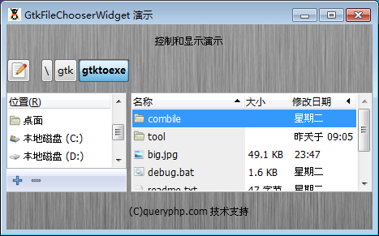

GtkFileChooserWidget 是一个允许选择一个文件的元件。这个元件适合让用户选择文件。它是 GtkFileChooserDialog的主要元件。对于所有的实际目的，它是单靠对话框就足够用了。然而，某些专门的应用程序可能需要这个元件来组成更大窗口的部分。

# 构造函数
~~~
GtkFileChooserWidget (GtkFileChooserAction action);  
~~~

使用此功能可以在自定义的窗口中嵌入创建一个文件选择元件。如果您使用的是GtkFileChooserDialog，你就不需要调用这个函数。
~~~
GtkFileChooserWidget::new_with_backend (GtkFileChooserAction action, string backend);  
~~~

如果你想允许非本地被选中的文件等的时候，这个构造函数就非常有用了。这是一个文件选择元件和可嵌入自定义窗口。此方法必须调用静态。

# GtkFileChooserAction
描述GtkFileChooser是否使用打开的现有文件或保存到一个可能的新文件。

|  符号名  |  描述  |
| --- | --- |
|  Gtk::FILE_CHOOSER_ACTION_OPEN  |  表示打开模式。文件选择只会让用户选择一个现有的文件。  |
|  Gtk::FILE_CHOOSER_ACTION_SAVE  |  指示保存模式。文件选择将让用户选择一个现有的文件或者键入一个新的文件名。  |
|  Gtk::FILE_CHOOSER_ACTION_SELECT_FOLDER  |  显示选择文件夹的打开模式。文件选择将让用户选择一个现有的文件夹。  |
|  Gtk::FILE_CHOOSER_ACTION_CREATE_FOLDER  |   表示创建一个新的文件夹的模式。文件选择会让用户选择现有文件夹或者创建新的新的文件夹 |

我们来测试一段代码结束，代码如下：
~~~
<?php          
if(!class_exists('gtk')){      
    die("php-gtk2 模块未安装 \r\n");  
}      
    
$label1=new GtkLabel('控制和显示演示');   
$label2=new GtkLabel('(C)queryphp.com 技术支持');   
  
$filechooserchooser= new GtkFileChooserWidget(Gtk::FILE_CHOOSER_ACTION_OPEN);   
  
$vbox1=new GtkVBox();   
$vbox1->add($label1);   
$vbox1->add($filechooserchooser);   
$vbox1->add($label2);   
  
$window1=new GtkWindow();   
$oPixbuf=GdkPixbuf::new_from_file('big.jpg');// 为窗口创建背景   
list($oPixmap,)= $oPixbuf->render_pixmap_and_mask(255);   
$oStyle=$window1->get_style();   
$oStyle=$oStyle->copy();   
$oStyle->bg_pixmap[Gtk::STATE_NORMAL]=$oPixmap;   
$window1->set_style($oStyle);   
$window1->set_title('GtkFileChooserWidget 演示');   
$window1->set_default_size(400,200);// 窗口大小   
$window1->add($vbox1);   
$window1->connect_simple('destroy',array('Gtk','main_quit'));   
$window1->show_all();   
Gtk::main(); 
~~~  

程序运行效果如下：
