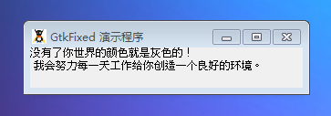

GtkFixed 是一个精确安放元件的容器。

GtkFixed 执行非自动布局，它留给程序员自己去放置和设置所有子元件，系统提供了put()和move()两个方法可以做到。add()方法不应该和 GtkFixed一起使用。

尽管 GtkFixed 容器提供了一个很好的纹理控制要求的应用程序布局，但是它不应该被应于大多数应用程序。我们之所以做出如下的提醒的原因之一为使用它需要非常小心和努力来阻止bug的产生（比如缩短的文本或者重叠的元件），这将会让添加和删除元件变得十分麻烦，可能的是许多其它的不得不被重新整理。它还有一些其它限制，特别地当它被来翻译文本和使用right-to-left（右到左）的语言。同样保持布局的一致性也是非常困难的，特别是在带有合成或者多窗口的应用程序中。

同时参考：**GtkTable, GtkBox.**

# 构造函数
~~~
GtkFixed ();  
~~~

创建一个全新的 GtkFixed 容器。

最后，我们以一段测试代码结束本节教材，代码如下：
~~~
<?php       
if(!class_exists('gtk')){       
    die("php-gtk2 模块未安装 \r\n");       
}   
  
$fixed1=new GtkFixed();   
  
$label1 = new GtkLabel("没有了你世界的颜色就是灰色的！\r\n 我会努力每一天工作给你创造一个良好的环境。");   
$fixed1->add($label1);   
  
// 创建GtkWindow窗口   
$wnd = new GtkWindow();   
$wnd->set_title('GtkFixed 演示程序');   
$wnd->set_default_size(300,-1);   
$wnd->connect_simple('destroy', array('Gtk', 'main_quit'));   
$wnd->add($fixed1);   
$wnd->show_all();   
Gtk::main();  
~~~

程序运行效果如下图所示：
