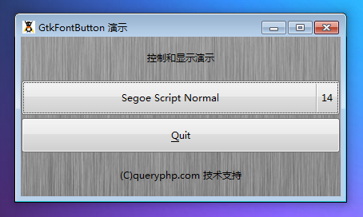

GtkFontButton 可以通过的对话框选择一种字体样式。它和 GtkColorButton 或者 GtkFileChooserButton 非常相似。这个按钮的两个功能是显示当前选择的字体以及点击后通过选择对话框加载字体。

当点击 GtkFontButton 将会加载一个 GtkFontSelectionDialog对话框。你可以通过它的方法来设置大部分属性。按钮对于选择对话框非常有用，在对话框中你可以选择一个字体。

# 构造函数
~~~
GtkFontButton ();  
~~~

# 创建一个新的 GtkFontButton 对象
~~~
GtkFontButton::new_with_font (string fontname);  
~~~

# 创建选中字体的新的 GtkFontButton对象

最后我们以一个测试程序结束本节教程，代码如下：
~~~
<?php       
if(!class_exists('gtk')){       
    die("php-gtk2 模块未安装 \r\n");  
}   
  
$window1=new GtkWindow();   
  
$label1=new GtkLabel('控制和显示演示');   
$label2=new GtkLabel('(C)queryphp.com 技术支持');   
  
$thebutton = new GtkFontButton();   
  
$toquit = new GtkButton('_Quit');   
$toquit->connect_simple(   
    'clicked',   
    array($window1, 'destroy')   
);   
  
$thevbox = new GtkVBox();   
$thevbox->pack_start($thebutton);   
$thevbox->pack_start($toquit);   
  
$vbox1=new GtkVBox();   
$vbox1->add($label1);   
$vbox1->add($thevbox);   
$vbox1->add($label2);   
  
  
$oPixbuf=GdkPixbuf::new_from_file('big.jpg');// 为窗口创建背景   
list($oPixmap,)= $oPixbuf->render_pixmap_and_mask(255);   
$oStyle=$window1->get_style();   
$oStyle=$oStyle->copy();   
$oStyle->bg_pixmap[Gtk::STATE_NORMAL]=$oPixmap;   
$window1->set_style($oStyle);   
$window1->set_title('GtkFontButton 演示');   
$window1->set_default_size(400,200);// 窗口大小   
$window1->add($vbox1);   
$window1->connect_simple('destroy',array('Gtk','main_quit'));   
$window1->show_all();   
Gtk::main();  
~~~

程序运行效果如下图：
