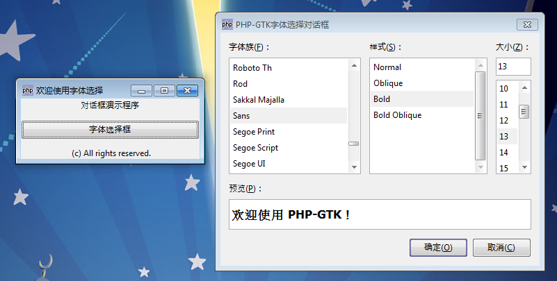

GtkFontSelectionDialog 为用户提供了一个字体选择器，它允许用户从字体库中选择一个字体。本元件继承至GtkFontSelection元件，它可以允许用户获取一个特定的字体。

它的构造函数为 GtkFontSelectionDialog (string title)，第一个参数表示字体对话框的标题，而且是必须的，通过构造函数可以创建一个字体选择器实例，通过这个实例中方法来执行相关操作。

同样，我们这里也通过一段代码来测试一下，代码如下：
~~~
<?php   
if(!class_exists('gtk')){   
      die("php-gtk2 模块未安装 \r\n");   
}   
  
$window1=new GtkWindow();   
$window1->set_title('欢迎使用字体选择');   
$window1->connect_simple('destroy', array('Gtk', 'main_quit'));   
  
function showChooseFont($button){   
        $fontselectiondialog1=new GtkFontSelectionDialog('PHP-GTK字体选择对话框');   
        $fontselectiondialog1->set_preview_text('欢迎使用 PHP-GTK！');   
        $fontselectiondialog1->set_position(Gtk::WIN_POS_CENTER_ON_PARENT);   
        $fontselectiondialog1->set_type_hint(Gdk::WINDOW_TYPE_HINT_DIALOG);   

        $label1=new GtkLabel();   
        $label1->set_label("欢迎使用字体选择器");   
        $label1->set_alignment(0.5, 0.5);   
        $label1->set_padding(0, 0);   
        $label1->set_visible(true, false);   
        $fontselectiondialog1->vbox->add($label1);   
        $fontselectiondialog1->cancel_button->connect('clicked','onCancel');   
        $fontselectiondialog1->ok_button->connect('clicked','onOk');   
        $fontselectiondialog1->show();   
}   
  
function onCancel(GtkButton $button=null){   
  $mainDialog=$button->get_toplevel();   
  $mainDialog->destroy();   
}   
  
function onOk(GtkButton $okButton=null){   
      $mainDialog=$okButton->get_toplevel();   
      $sFont=$mainDialog->get_font_name();   
      $msg = new GtkMessageDialog(null,0,Gtk::MESSAGE_INFO,Gtk::BUTTONS_OK,"你选中的字体为：  

      \r\n".$sFont);   
      $msg->set_title('选中字体');   
      $msg->run();   
      $msg->destroy();   
      $mainDialog->destroy();   
}   
  
$vbox1=new GtkVBox();   
$vbox1->set_homogeneous(false);   
$vbox1->set_spacing(10);   
$window1->add($vbox1);   
  
$label1=new GtkLabel();   
$label1->set_label(" (c) All rights reserved.");   
$label1->set_alignment(0.5, 0.5);   
$label1->set_padding(0, 0);   
$label1->set_visible(true, false);   
  
$label2=new GtkLabel();   
$label2->set_label("对话框演示程序");   
$label2->set_alignment(0.5, 0.5);   
$label2->set_padding(0, 0);   
$label2->set_visible(true, false);   
  
$button1=new GtkButton();   
$button1->set_label('字体选择框');   
$button1->set_visible(true, false);   
$button1->connect('clicked','showChooseFont');   
  
$vbox1->pack_start($label2);   
$vbox1->pack_start($button1);   
$vbox1->pack_start($label1);   
  
// 显示对话框   
$window1->show_all();   
  
// 开始主循环   
Gtk::main();   
?>  
~~~

运行效果如下：
