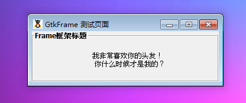

GtkFrame 是一个直接继承至 GtkBin 带有边框和一个随意的标签的元件。它经常被用于在一个组织好和有趣的应用中的程序中容纳你的元件。

如果一个标签是确定的，它将会出现在frame的顶部。你可以使用set_label_align()来设置标签的位置。一个值得重要的值得注意的事，GtkFrame直接继承至GtkBin，所以它只能容纳一个元件。

# 构造函数
~~~
GtkFrame ([string label = null]);  
~~~

使用构造函数来创建一个新的框架。你可以通过构造函数传递一个特殊的标签，这个标签将会显示在frame的顶部。当然，当一个框架被创建后，你也可以通过set_label_widget()或者set_label()来将一个标签添加至框架。

下面我们来通过一段测试代码演示一下，代码如下：
~~~
<?php       
if(!class_exists('gtk')){       
	die("php-gtk2 模块未安装 \r\n");   
}   
  
$label1=new GtkLabel('frame1');   
$label1->set_label("<b>Frame框架标题</b>");   
$label1->set_use_markup(true);   
$label1->set_alignment(0.5, 0.5);           
$label1->set_padding(0, 0);           
$label1->set_visible(true, false);   
  
$label2=new GtkLabel();           
$label2->set_label("我非常喜欢你的头发！\r\n 你什么时候才是我的？");       
$label2->set_alignment(0.5, 0.5);           
$label2->set_padding(0, 0);           
$label2->set_visible(true, false);   
  
$alignment1=new GtkAlignment();           
$alignment1->set_padding(0,0,12,0);       
$alignment1->set(0.5,0.5,1.00,1.00);   
$alignment1->add($label2);           
$alignment1->set_visible(true, false);   
  
// 创建GtkFrame   
$frame1 = new GtkFrame('测试代码');   
$frame1->set_label_align(0,0.5);   
$frame1->add($alignment1);   
$frame1->set_label_widget($label1);   
$frame1->set_extension_events(Gdk::EXTENSION_EVENTS_CURSOR);   
$frame1->set_visible(true, false);   
  
// 创建窗口   
$wnd = new GtkWindow();   
$wnd->set_title('GtkFrame 测试页面');   
$wnd->set_default_size(300, -1);   
$wnd->connect_simple('destroy', array('Gtk', 'main_quit'));   
$wnd->add($frame1);   
$wnd->show_all();   
Gtk::main();  
~~~ 

程序运行效果如下图所示：
