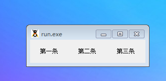
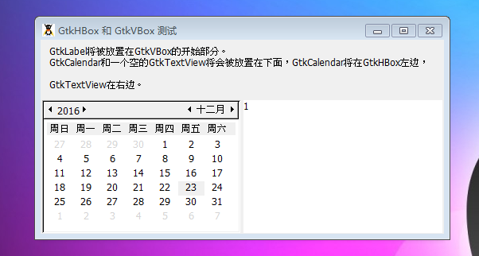

GtkHBox容器被定义去水平组织子元素到一条直线上，所有子元素都拥有相同的高度。它能够根据子元素的尺寸提供任何大的尺寸，子元素占用少于配置的空间，它们在各自的空间中默认水平居中。

我们使用继承至GtkBox类的的packing方法将子元素添加至GtkHBox中，比如说pack_start()或者add()，将子元素添加至所有容器元件中。

GtkHBox和GtkVBox是一组可以比较的，它们的使用方法一致。

同时参考： **GtkVBox, GtkTable, GtkButtonBox, GtkBox, GtkContainer.**

# 构造函数
~~~
GtkHBox ([bool homogeneous = false [, int spacing = 0]]);  
~~~

参数 homogeneous是一个boolean值，它决定着容器中所有子元件是否应该根据最大元件的宽度排列。默认的行为（false）是为了保持各个元件各自的宽度不被改变。第二个参数，空间，定义着元件左边的空间的最低像素数。

我们这里做一个测试来看一下，程序代码如下：
~~~
<?php       
if(!class_exists('gtk')){       
 	die("php-gtk2 模块未安装 \r\n");    
}   
  
$label1=new GtkLabel();   
$label1->set_label("第一条");   
$label1->set_alignment(0.5, 0.5);   
$label1->set_padding(0, 0);   
$label1->set_visible(true, false);   
  
$label2=new GtkLabel();   
$label2->set_label("第二条");   
$label2->set_alignment(0.5, 0.5);   
$label2->set_padding(0, 0);   
$label2->set_visible(true, false);   
  
$label3=new GtkLabel();   
$label3->set_label("第三条");   
$label3->set_alignment(0.5, 0.5);   
$label3->set_padding(0, 0);   
$label3->set_visible(true, false);   
  
$hbox1=new GtkHBox();   
$hbox1->set_homogeneous(false);   
$hbox1->set_spacing(0);   
$hbox1->pack_start($label1, true, true, 0);   
$hbox1->pack_start($label2, true, true, 0);   
$hbox1->pack_start($label3, true, true, 0);   
$hbox1->set_visible(true, false);   
  
$window1=new GtkWindow();           
$window1->add($hbox1);   
  
$window1->show_all();   
Gtk::main();   
~~~

程序运行效果如下图所示：

我们还做一个测试，示例代码如下：
~~~
<?php       
if(!class_exists('gtk')){       
 	die("php-gtk2 模块未安装 \r\n");        
}   
  
// 创建GtkWindow   
$window = new GtkWindow();   
$window->set_title("GtkHBox 和 GtkVBox 测试");   
$window->set_position(Gtk::WIN_POS_CENTER);   
$window->connect_simple("destroy", array("gtk", "main_quit"));   
$window->show();   
  
// 将垂直容器GtkVBox添加至窗口   
$vbox = new GtkVBox(false,5);   
$window->add($vbox);   
  
// 将GtkLabel添加至GtkVBox的上部   
$label = new GtkLabel();   
$label->set_text("GtkLabel将被放置在GtkVBox的开始部分。\n\rGtkCalendar和一个空的GtkTextView将会被放置在下面，GtkCalendar将在GtkHBox左边，  
 
GtkTextView在右边。");   
$label->set_justify(Gtk::JUSTIFY_LEFT);   
$vbox->pack_start($label, true, true, 5);   
$label->show();   
  
// 创建水平容器GtkHBox   
$hbox = new GtkHBox(true, 0);   
$vbox->pack_end($hbox);   
  
// 创建一个日历放置在水平容器的左边   
$calendar = new GtkCalendar();   
$hbox->pack_start($calendar, true, true, 2);   
$calendar->show();   
  
// 创建一个GtkTextView在右边   
$text = new GtkTextView();   
$text->set_editable(true);   
$hbox->pack_end($text, true, true, 2);   
$text->show();   
  
$window->show_all();   
Gtk::main();   
~~~

程序运行结果如下图：
