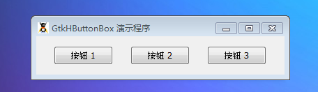

GtkHButtonBox 将一些按钮水平地摆在一排。在应用程序中，按钮盒子能够提供一个排列按钮的容器。我们使用像其它容器一样的添加元件的方法add().pack_start和pack_end方法跟add()是一样的效果，根据当前布局样式添加元件和取决于子按钮是否使用调用set_child_secondary()。

按钮之间的空隙可以使用set_spacing()设置。按钮的安排和布局可以通过set_layout()来设置。

# 构造函数
~~~
void GtkHButtonBox ();  
~~~

创建一个新的 GtkHButtonBox对象实例。

我们使用如下的测试代码，代码如下：
~~~
<?php       
if(!class_exists('gtk')){       
    die("php-gtk2 模块未安装 \r\n"); 
}   
  
$hbbox = new GtkHButtonBox();   
$hbbox->set_layout(Gtk::BUTTONBOX_SPREAD);   
$hbbox->set_spacing(25);   
  
$button1 = new GtkButton('按钮 1');   
$button2 = new GtkButton('按钮 2');   
$button3 = new GtkButton('按钮 3');   
$hbbox->add($button1);   
$hbbox->add($button2);   
$hbbox->add($button3);   
  
// 创建GtkWindow窗口   
$wnd = new GtkWindow();   
$wnd->set_title('GtkHButtonBox 演示程序');   
$wnd->set_default_size(300,-1);   
$wnd->connect_simple('destroy', array('Gtk', 'main_quit'));   
$wnd->add($hbbox);   
$wnd->show_all();   
Gtk::main();  
~~~

> 注意：值得注意的是 GtkHButtonBox 的构造函数没人任何参数。同时，像其它容器元件一样，GtkHButtonBox 不会占用空间直到子元件到位。

程序运行效果如下：
