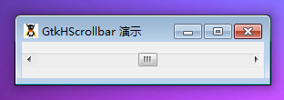

GtkHScrollbar 是一个水平的滚动条元件。可以通过查看 GtkScrollbar 发现更多细节信息。

你可以使用 GtkAdjustment来设置滚动条的边界。

如果你需要将滚动条添加至 GtkTextView 或者 GtkTreeView，你可以使用 GtkScrolledWindow。

# 构造函数
~~~
GtkHScrollbar ([GtkAdjustment adjustment = null]);   
~~~

创建一个新的水平滚动条。如果 adjustment为null或者没有设置，一个自动的 GtkAdjustment 会为你创建。因为所有调节器的值为 0，这非常方便和快捷够过构造函数初始化调节器。

最后我们以一个测试程序结束本节教程，代码如下：
~~~
<?php       
if(!class_exists('gtk')){       
    die("php-gtk2 模块未安装 \r\n");       
}   
  
$value     = 50;   
$lower     = 1;   
$upper     = 100;   
$step_incr = 1;   
$page_incr = 10;   
$page_size = 10;   
  
$adj = new GtkAdjustment(   
    $value, $lower, $upper,   
    $step_incr, $page_incr, $page_size  
);   
  
$sb = new GtkHScrollbar($adj);   
$sb->set_name('my-scrollbar');   
$adj->set_value(50);   
  
Gtk::rc_parse_string('   
style "mysbstyle" {   
  GtkVScrollbar::has-forward-stepper = 0   
  GtkVScrollbar::has-secondary-forward-stepper = 1   
  GtkVScrollbar::fixed-slider-length = 1   
  GtkVScrollbar::min-slider-length = 5   
} widget "*.my-scrollbar" style "mysbstyle"');   
  
$wnd = new GtkWindow();   
$wnd->set_title('GtkHScrollbar 演示');   
$wnd->set_default_size(300,50);   
$wnd->add($sb);   
$wnd->show_all();   
$wnd->connect_simple('destroy', array('Gtk', 'main_quit'));   
  
Gtk::main();  
~~~

程序运行效果如下图：
