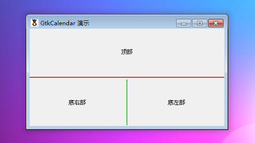

GtkHSeparator 是一个水平分隔线元件。它是一个包含一个带有一层阴影的一个水平线，使得它看起来像是刻到窗口的元件。它用来分割垂直布局的元件。

> 请注意：GtkHSeparator 不能够被添加到GtkMenus。基于这个目的，你可以查看 GtkSeparatorMenuItem，因为它是菜单的专用分割元件。

同样也可以参考：**GtkVSeparator。**

# 构造函数
~~~
GtkHSeparator ();  
~~~

创建一个新的 GtkHSeparator 对象，然后添加到它的父元件，它为一条水平线。我们可以使用容器的大包方法(比如，pack_start())来组织水平线周围的空隙。

我们来测试一段代码结束，代码如下：
~~~
<?php          
if(!class_exists('gtk')){      
    die("php-gtk2 模块未安装 \r\n");  
}   
  
// 创建二个容器   
$vbox = new GtkVBox();   
$hbox = new GtkHBox();   
  
// 创建三个文字标签   
$label_top = new GtkLabel('顶部');   
$label_br = new GtkLabel('底右部');   
$label_bl = new GtkLabel('底左部');   
  
// 分割线   
$vsep = new GtkVSeparator();   
$hsep = new GtkHSeparator();   
  
// 对分隔条进行修饰   
$green = new GdkColor(0, 65000, 0);   
$red = new GdkColor(65000,0,0);   
$style_1 = new GtkStyle();   
$style_2 = new GtkStyle();   
$style_1->bg[GTK::STATE_NORMAL] = $red;   
$style_2->bg[GTK::STATE_NORMAL] = $green;   
$hsep->set_style($style_1);   
$vsep->set_style($style_2);   
  
$vbox->pack_start($label_top);   
$vbox->pack_start($hsep, false, false, 3);   
$vbox->pack_start($hbox);   
$hbox->pack_start($label_br);   
$hbox->pack_start($vsep, false, false, 3);   
$hbox->pack_start($label_bl, true, true);   
  
$win = new GtkWindow();   
$win->set_position(Gtk::WIN_POS_CENTER);   
$win->set_title('GtkCalendar 演示');   
$win->set_default_size(400,200);   
$win->add($vbox);   
$win->connect_simple('destroy', array('Gtk','main_quit'));   
$win->show_all();   
Gtk::main(); 
~~~ 

程序运行效果如下：
