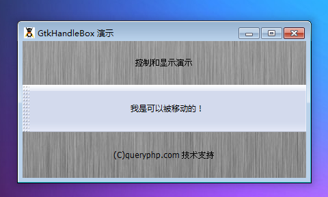

GtkHandleBox 是一个创建可拆卸的窗口元素的容器。GtkHandleBox部件允许一个窗口的一部分被“撕下”。这是一个显示其子元件和一个手柄的bin元件，用户可以拖动撕下一个单独的包含子元件的窗口（浮动窗口）。拖动后剩下的画在原来的handlebox的位置。通过拖动的单独窗口还可以恢复到原来的的位置，它是可以复位的。

当重新连接时，拖动后剩下的和浮动窗口，必须沿着一条边，单元边缘对齐。这个可以由程序员明确指定，或者在GTK +会设置一个默认的边缘。

让分离和重新附加的 handlebox尽可能给用户带来最小的混淆，重要的是当handlebox处于分离状态设置单元边缘不动。例如，如果handlebox装在一个VBox底部，当分离handlebox时，底边的handlebox将保持固定作为的handlebox缩小的高度，所以应设置为GTK:: POS_BOTTOM为单元边缘。

# GtkPositionType
描述元件的边缘的确切定位，例如GtkNotebook一个标签，GtkHandleBox的句柄或一个GtkScale的标签。

|  值符号  |  名称  |  说明  |
| --- | --- | --- |
| 0   |  Gtk::POS_LEFT  |  左边缘  |
|  1  |  Gtk::POS_RIGHT  |  右边缘  |
|  2  |  Gtk::POS_TOP  |  顶部边缘  |
|  3   |  Gtk::POS_BOTTOM  |  底部边缘  |

# 构造函数
~~~
GtkHandleBox (); 
~~~

创建一个新的可拖动的盒子。

我们来一段测试程序，代码如下：
~~~
<?php          
if(!class_exists('gtk')){      
    die("php-gtk2 模块未安装 \r\n");   
}      
    
$label1=new GtkLabel('控制和显示演示');   
$label2=new GtkLabel('(C)queryphp.com 技术支持');   
  
$handlebox = new GtkHandleBox();   
$handlebox->add(new GtkLabel('我是可以被移动的！'));   
  
$vbox1=new GtkVBox();   
$vbox1->add($label1);   
$vbox1->add($handlebox);   
$vbox1->add($label2);   
  
$window1=new GtkWindow();   
$oPixbuf=GdkPixbuf::new_from_file('big.jpg');// 为窗口创建背景   
list($oPixmap,)= $oPixbuf->render_pixmap_and_mask(255);   
$oStyle=$window1->get_style();   
$oStyle=$oStyle->copy();   
$oStyle->bg_pixmap[Gtk::STATE_NORMAL]=$oPixmap;   
$window1->set_style($oStyle);   
$window1->set_title('GtkHandleBox 演示');   
$window1->set_default_size(400,200);// 窗口大小   
$window1->add($vbox1);   
$window1->connect_simple('destroy',array('Gtk','main_quit'));   
$window1->show_all();   
Gtk::main();  
~~~

程序运行效果如下：
