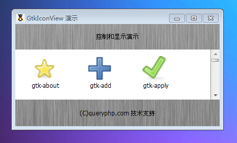

GtkIconView 是一个在网格中显示图标的列表元件。GtkIconView 提供了一个列表模式的另一种视图：它显示为一个在网格中带标签的图标模型，获取你已经在Window 操作系统的文件管理器中看到了这个。

和 GtkTreeView一样，它允许选择一个或多个项目（取决于选择模式，请参阅set_selection_mode()）。除了用箭头键选择，GtkIconView支持网格的选择，这是通过拖动指针控制。

# 构造函数
~~~
GtkIconView ();  
~~~

创建一个的新的 GtkIconView实例。为了让它实质显示一些东西，你需要添加一个数据模型（如一个GtkListStore）和一些滚动条。

我们来一段测试程序，代码如下：
~~~
<?php          
if(!class_exists('gtk')){      
    die("php-gtk2 模块未安装 \r\n");     
}      
    
$label1=new GtkLabel('控制和显示演示');   
$label2=new GtkLabel('(C)queryphp.com 技术支持');   
  
$iv = new GtkIconView();   
  
$model = new GtkListStore(GdkPixbuf::gtype, GObject::TYPE_STRING);   
$iv->set_model($model);   
  
$ids = Gtk::stock_list_ids();   
sort($ids);   
foreach ($ids as $id) {   
    $pixbuf = $iv->render_icon($id, Gtk::ICON_SIZE_DIALOG);   
    $model->set($model->append(), 0, $pixbuf, 1, $id);   
}   
  
$iv->set_pixbuf_column(0);   
$iv->set_text_column(1);   
  
$iv->set_columns(0);   
$iv->set_item_width(100);   
  
$scrollwin = new GtkScrolledWindow();   
$scrollwin->set_policy(   
    Gtk::POLICY_AUTOMATIC,   
    Gtk::POLICY_AUTOMATIC   
);   
$scrollwin->add($iv);   
  
$vbox1=new GtkVBox();   
$vbox1->add($label1);   
$vbox1->add($scrollwin);   
$vbox1->add($label2);   
  
$window1=new GtkWindow();   
$oPixbuf=GdkPixbuf::new_from_file('big.jpg');// 为窗口创建背景   
list($oPixmap,)= $oPixbuf->render_pixmap_and_mask(255);   
$oStyle=$window1->get_style();   
$oStyle=$oStyle->copy();   
$oStyle->bg_pixmap[Gtk::STATE_NORMAL]=$oPixmap;   
$window1->set_style($oStyle);   
$window1->set_title('GtkIconView 演示');   
$window1->set_default_size(400,200);// 窗口大小   
$window1->add($vbox1);   
$window1->connect_simple('destroy',array('Gtk','main_quit'));   
$window1->show_all();   
Gtk::main(); 
~~~ 

程序运行效果如下：
