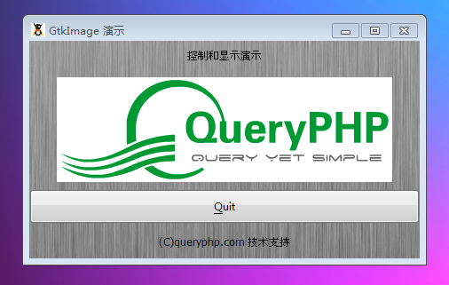

GtkImage 用于显示一张图片。有很多对象可以被显示为一张图像。通常你可能从一个文件加载一个 GdkPixbuf("pixel buffer")，接着显示它。这里你可以通过如下的方法来做，GtkImage::new_from_file()，像如下使用方法。
~~~
$img= GtkImage::new_from_file('logo.gif')
~~~

如果文件没有加载成功，图像就会和许多 Web浏览器一样显示一个“损坏的图像”图标。如果你需要加载你自己的文件来显示错误，比如说你显示一个错误的消息，接着使用 GdkPixbuf::new_from_file()，再接着使用 GtkImage::new_from_pixbuf()来创建 GtkImage。

图像有可能为一个动画，如果 GtkImage将要显示为一张动画（GdkPixbufAnimation）代替静态图片。

GtkImage 为 GtkMisc的子类，这意味着你可以使用GtkMisc的方法给图像对齐（中，左，右）和添加空隙给它。

GtkImage 是一个“没有窗口”的元件（没有自己的 GdkWindow），所以它自己不能够接受事件。如果你想要在图像上使用事件，比如说按钮点击，你可以将图像放置在 GtkEventBox 中，接着给事件盒子连接事件信号。

# 构造函数
~~~
GtkImage (); 
~~~

创建一个空的 GtkImage。然后你可以set_from_* 这些方法来设置图像内容。
~~~
GtkImage::new_from_animation (GdkPixbufAnimationanimation);   
~~~

使用给定的动画来创建图像。
~~~
GtkImage::new_from_file (filename);  
~~~

从一个文件创建一个图像。如果文件不存在或者不能够被加载，GtkImage 将会显示一张“损坏的图像”的图标。

如果文件包含一个动画，图像将会包含一个动画。

如果你需要探究加载文件时的错误，你可以使用 GdkPixbuf::new_from_file()来加载你自己的文件，接着从pixbuf中创建 GtkImage（或者使用GdkPixbufAnimation::new_from_file()创建动画）。

返回的图像的储存类型（get_storage_type()）没有定义，它将是非常合适地显示文件。
~~~
GtkImage::new_from_icon_set (GtkIconSet iconset, GtkIconSize size);   
~~~

创建一个用于显示图标的 GtkImage。图标大小例子像 Gtk::ICON_SIZE_MENU, Gtk::ICON_SIZE_SMALL_TOOLBAR。

作为使用这个方法的替代，最好可以创建一个 GtkIconFactory，将icon放置到图标工厂，接着使用add_default()方法将图标工厂添加到默认工厂列表，再接着使用 GtkImage::new_from_stock()。这样在应用程序中允许覆盖图标。
~~~
GtkImage::new_from_image (GdkImage image, mask);   
~~~

创建一个带有mask的 GtkImage。GdkImage 是一个在当前像素格式的带有客户端的图像缓冲。

如果你需要自己捕获错误，你应该使用 GtkImage的构造函数，因为 GdkImage 的构造函数会抛出明确的错误消息。
~~~
GtkImage::new_from_pixbuf (GdkPixbuf pixbuf);   
~~~

创建一个显示 pixbuf的GtkImage，GdkPixbuf 是一个用于客户端图像处理的库。值得注意的是这个函数仅仅从pixbuf创建一个 GtkImage。GtkImage的创建并不会影响状态改变。如果你想要那样的话，你可以使用 GtkImage::new_from_set()。
~~~
GtkImage::new_from_pixmap (GdkPixmap pixmap, mask);   
~~~

创建一个带有mask的用于显示 pixmap的 GtkImage。GdkPixmap 是一个在当前像素格式的带有服务端的图像缓冲。
~~~
GtkImage::new_from_stock (GtkStockItems stock_id, GtkIconSize size);   
~~~

创建用于显示系统的图标的 GtkImage。icon的名字例子 Gtk::STOCK_OPEN, Gtk::STOCK_EXIT。系统图标大小 Gtk::ICON_SIZE_MENU,Gtk::ICON_SIZE_SMALL_TOOLBAR。如果图标名字属于未知，这个时候“损坏的图像”图标将会代替。你可以通过add_default()和add()来注册自己的图标名字。
~~~
GtkImage::new_from_icon_name (icon_name, size);   
~~~

通过图标名字创建 GtkImage。

最后我们以一个测试程序结束本节教程，代码如下：
~~~
<?php       
if(!class_exists('gtk')){       
    die("php-gtk2 模块未安装 \r\n");      
}   
  
$window1=new GtkWindow();   
  
$label1=new GtkLabel('控制和显示演示');   
$label2=new GtkLabel('(C)queryphp.com 技术支持');   
  
$theimage = GtkImage::new_from_file('logo.png');   
  
$toquit = new GtkButton('_Quit');   
$toquit->connect_simple(   
    'clicked',   
    array($window1, 'destroy')   
);   
  
$thevbox = new GtkVBox();   
$thevbox->pack_start($theimage);   
$thevbox->pack_start($toquit);   
  
$vbox1=new GtkVBox();   
$vbox1->add($label1);   
$vbox1->add($thevbox);   
$vbox1->add($label2);   
  
  
$oPixbuf=GdkPixbuf::new_from_file('big.jpg');// 为窗口创建背景   
list($oPixmap,)= $oPixbuf->render_pixmap_and_mask(255);   
$oStyle=$window1->get_style();   
$oStyle=$oStyle->copy();   
$oStyle->bg_pixmap[Gtk::STATE_NORMAL]=$oPixmap;   
$window1->set_style($oStyle);   
$window1->set_title('GtkImage 演示');   
$window1->set_default_size(400,200);// 窗口大小   
$window1->add($vbox1);   
$window1->connect_simple('destroy',array('Gtk','main_quit'));   
$window1->show_all();   
Gtk::main();
~~~  

程序运行效果如下图：
