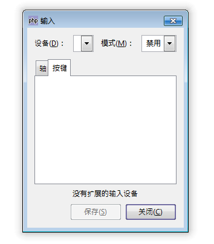

GtkInputDialog 是为输入设备设计的对话框，该对话框在Gtk+中极少使用，并且未来可能会移动到其它的包中，PHP-GTK 2官方并不建议大家使用该对话框。

同样，我们这里也通过一段代码来测试一下，代码如下：
~~~
<?php   
if(!class_exists('gtk')){   
	die("php-gtk2 模块未安装 \r\n");   
}   
  
$inputdialog1=new GtkInputDialog();   
$inputdialog1->set_title('输入');   
$inputdialog1->set_position(Gtk::WIN_POS_CENTER_ON_PARENT);   
$inputdialog1->set_type_hint(Gdk::WINDOW_TYPE_HINT_DIALOG);   
  
$inputdialog1->show_all();   
  
// 开始主循环   
Gtk::main();   
?>  
~~~

运行效果如下：
