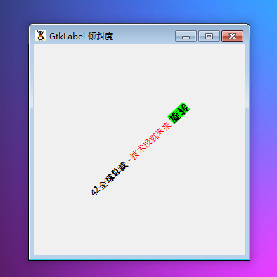

GtkLabel 是用于显示一段文本的元件。顾名思义，大多数标签用于其它的元件比如 GtkButton,GtkMenuItem或者GtkOptionMenu。

你可以通过一些方法如 set_justify()或set_width_chars()来控制 GtkLabel 的显示。如果你希望定义布局（值得注意的是排列和整理版面不是一回事）或者设置GtkLabel的空隙，你可以将 GtkLabel放置在 GtkAlignment容器中。

# 构造函数
~~~
GtkLabel ([string string = null [, boolean parse_mnemonic = false]]);  
~~~

创建一个带有配置项的文本。如果你设置 parse_mnemonic为true，标签会设置第一个右边为下划线“_”的文字为助记键。

最后我们以一个测试程序结束本节教程，代码如下：
~~~
<?php       
if(!class_exists('gtk')){       
    die("php-gtk2 模块未安装 \r\n");      
}   
  
function rotate($label) {   
    $label->set_label(   
        $label->get_angle()   
        . '<b>全球总裁</b> - '    
        . '技术成就未来'   
        . ' 旋转'   
    );   
    $label->set_angle($label->get_angle() + 1);   
    return true;   
}   
  
$wnd = new GtkWindow();   
$wnd->set_default_size(300,300);   
$wnd->set_title('GtkLabel 倾斜度');   
$wnd->connect_simple('destroy', array('Gtk', 'main_quit'));   
  
$label = new GtkLabel('t_est', true);   
$label->set_use_markup(true);   
  
$wnd->add($label);   
$wnd->show_all();   
  
Gtk::timeout_add(1000, 'rotate', $label);   
Gtk::main(); 
~~~ 

程序运行效果如下图：
