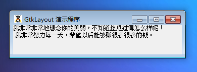

GtkLayout 是一个无限滚动的容器。

这个比较简单，这里也不多说了，测试代码如下：
~~~
<?php       
if(!class_exists('gtk')){       
    die("php-gtk2 模块未安装 \r\n");  
}   
  
$layout1=new GtkLayout();   
  
$label1 = new GtkLabel("我非常非常地想念你的美丽，不知道丝瓜过得怎么样呢！\r\n 我非常努力每一天，希望以后能够赚很多很多的钱。");   
$layout1->add($label1);   
  
// 创建GtkWindow窗口   
$wnd = new GtkWindow();   
$wnd->set_title('GtkLayout 演示程序');   
$wnd->set_default_size(300,-1);   
$wnd->connect_simple('destroy', array('Gtk', 'main_quit'));   
$wnd->add($layout1);   
$wnd->show_all();   
Gtk::main();
~~~  

程序运行效果如下：
