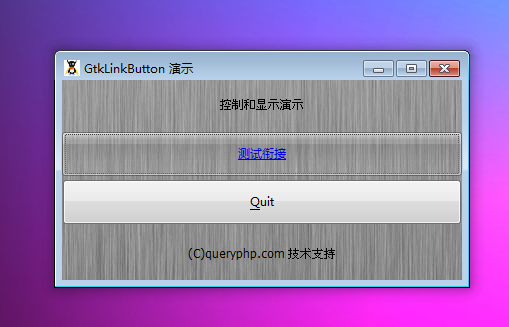

PHP-GTK 2 目前貌似并没有完善 GtkLinkButton 衔接按钮元件，留待以后再说。

最后我们以一个测试程序结束本节教程，代码如下：
~~~
<?php       
if(!class_exists('gtk')){       
    die("php-gtk2 模块未安装 \r\n");  
}   
  
$window1=new GtkWindow();   
  
$label1=new GtkLabel('控制和显示演示');   
$label2=new GtkLabel('(C)queryphp.com 技术支持');   
  
$thebutton = new GtkLinkButton('http://www.queryphp.com','测试衔接');
$thebutton->set_relief(Gtk::RELIEF_NONE);   
  
$toquit = new GtkButton('_Quit');   
$toquit->connect_simple(   
    'clicked',   
    array($window1, 'destroy')   
);   
  
$thevbox = new GtkVBox();   
$thevbox->pack_start($thebutton);   
$thevbox->pack_start($toquit);   
  
$vbox1=new GtkVBox();   
$vbox1->add($label1);   
$vbox1->add($thevbox);   
$vbox1->add($label2);   
  
  
$oPixbuf=GdkPixbuf::new_from_file('big.jpg');// 为窗口创建背景   
list($oPixmap,)= $oPixbuf->render_pixmap_and_mask(255);   
$oStyle=$window1->get_style();   
$oStyle=$oStyle->copy();   
$oStyle->bg_pixmap[Gtk::STATE_NORMAL]=$oPixmap;   
$window1->set_style($oStyle);   
$window1->set_title('GtkLinkButton 演示');   
$window1->set_default_size(400,200);// 窗口大小   
$window1->add($vbox1);   
$window1->connect_simple('destroy',array('Gtk','main_quit'));   
$window1->show_all();   
Gtk::main();
~~~   

# 替代方法
~~~
function url($sUrl){
    // Windows 平台
    if(DIRECTORY_SEPARATOR == '\\'){
        exec("start {$sUrl}") ;
    }
    
    // 尝试使用 Gnome 环境 中的命名
    else{
        exec("gnome-open {$sUrl}") ;
    }
}
~~~

程序运行效果如下图：
