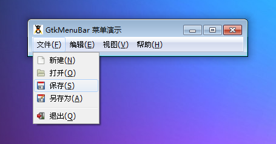

GtkMenuBar 是一个容纳菜单的元件。这个元件是创建一个基本的菜单的基础。首先，你需要创建一个 GtkMenuBar，然后添加 GtkMenuItems 到里面。它的结果将是一个独立的将会被放置在应用程序中的菜单条。

# 构造函数
~~~
GtkMenuBar ();  
~~~

使用构造函数创建一个新的 GtkMenuBar 元件，然后添加 GtkMenuItems 到里面。
这个元件是 GtkMenuShell的子类，所有来自GtkMenuShell 的方法都可以在这里使用。

我们在这里写下如下的代码来测试一下，代码如下：
~~~
<?php       
if(!class_exists('gtk')){       
    die("php-gtk2 模块未安装 \r\n");  
}   
  
// 菜单   
$imagemenuitem1=new GtkImageMenuItem('gtk-new');   
$imagemenuitem1->child->set_use_underline(1);   
$imagemenuitem2=new GtkImageMenuItem('gtk-open');           
$imagemenuitem2->child->set_use_underline(1);   
$imagemenuitem3=new GtkImageMenuItem('gtk-save');       
$imagemenuitem3->child->set_use_underline(1);   
$imagemenuitem4=new GtkImageMenuItem('gtk-save-as');       
$imagemenuitem4->child->set_use_underline(1);   
$separatormenuitem1=new GtkSeparatorMenuItem();   
$imagemenuitem5=new GtkImageMenuItem('gtk-quit');       
$imagemenuitem5->child->set_use_underline(1);   
  
$menu1=new GtkMenu();           
$menu1->append($imagemenuitem1);       
$menu1->append($imagemenuitem2);           
$menu1->append($imagemenuitem3);           
$menu1->append($imagemenuitem4);           
$menu1->append($separatormenuitem1);   
$menu1->append($imagemenuitem5);   
  
$menuitem1=new GtkMenuItem('文件(_F)');   
$menuitem1->child->set_use_underline(1);   
$menuitem1->set_submenu($menu1);   
  
$imagemenuitem6=new GtkImageMenuItem('gtk-cut');           
$imagemenuitem6->child->set_use_underline(1);   
$imagemenuitem7=new GtkImageMenuItem('gtk-copy');           
$imagemenuitem7->child->set_use_underline(1);   
$imagemenuitem8=new GtkImageMenuItem('gtk-paste');           
$imagemenuitem8->child->set_use_underline(1);   
$imagemenuitem9=new GtkImageMenuItem('gtk-delete');           
$imagemenuitem9->child->set_use_underline(1);   
  
$menu2=new GtkMenu();   
$menu2->append($imagemenuitem6);           
$menu2->append($imagemenuitem7);           
$menu2->append($imagemenuitem8);           
$menu2->append($imagemenuitem9);   
  
$menuitem2=new GtkMenuItem('编辑(_E)');           
$menuitem2->child->set_use_underline(1);           
$menuitem2->set_submenu($menu2);       
  
$menuitem3=new GtkMenuItem('视图(_V)');   
$menuitem3->child->set_use_underline(1);   
  
$imagemenuitem10=new GtkImageMenuItem('gtk-about');           
$imagemenuitem10->child->set_use_underline(1);   
  
$menu3=new GtkMenu();           
$menu3->append($imagemenuitem10);   
  
$menuitem4=new GtkMenuItem('帮助(_H)');       
$menuitem4->child->set_use_underline(1);       
$menuitem4->set_submenu($menu3);   
  
// 创建菜单GtkMenuBar   
$menubar1=new GtkMenuBar();   
$menubar1->append($menuitem1);   
$menubar1->append($menuitem2);   
$menubar1->append($menuitem3);   
$menubar1->append($menuitem4);   
  
// 创建窗口GtkWindow   
$wnd = new GtkWindow();   
$wnd->set_title('GtkMenuBar 菜单演示');   
$wnd->add($menubar1);   
$wnd->connect_simple('destroy', array('Gtk', 'main_quit'));   
$wnd->show_all();   
Gtk::main();  
~~~

程序运行结果如下图：
