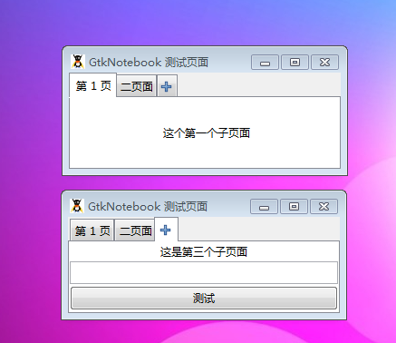

GtkNotebook元件是一个GtkContainer容器，它的子元素是一些能够通过一条边的tab标签互相切换的页面。

GtkNotebook拥有很多设置项。另一方面，你可以选择那一边存放tabs标签（set_tab_pos()）,然后，如果拥有太多的tabs标签，你应该让GtkNotebook大一些或者设置它可以卷动（set_scrollable()）,而且这里会有弹出菜单让用户切换页面（popup_enable(),popup_disable()）。

# set_tab_pos(GtkPositionType pos)参考
设置由那边来存放tabs标签，参数为枚举类型。

# GtkPositionType 详解
描述元件边缘的位置，比如说GtkNotebook的tabs，GtkHandleBox的handle或者GtkScale的标签。

| 值   |  符号名称  | 描述   |
| --- | --- | --- |
|  0  |  Gtk::POS_LEFT  |  左边缘  |
|  1  |  Gtk::POS_RIGHT  |  右边缘  |
|  2  |  Gtk::POS_TOP  |  上边缘  |
|  3  |  Gtk::POS_BOTTOM  | 下边缘   |

说白了这里跟我们网页中的tab一样，我们最后以一个演示代码结束本节教程，代码如下：
~~~
<?php       
if(!class_exists('gtk')){       
	die("php-gtk2 模块未安装 \r\n");   
}   
  
// 创建GtkNotebook   
$ntbk = new GtkNotebook();   
  
// 创建第一个页面，没有标签   
$ntbk->append_page( new GtkLabel('这个第一个子页面') );   
  
// 创建第二个页面，代码一个tab标签   
$ntbk->append_page(   
    new GtkLabel('这个第二个子页面'),   
    new GtkLabel('二页面')   
);   
  
// 创建第三个页面   
$vbox = new GtkVBox();   
$vbox->pack_start(new GtkLabel('这是第三个子页面'));   
$vbox->pack_start(new GtkEntry(), false, false);   
$vbox->pack_start(new GtkButton('测试'), false, false);   
$ntbk->append_page(   
    $vbox,   
    GtkImage::new_from_stock(   
        Gtk::STOCK_ADD,   
        Gtk::ICON_SIZE_MENU   
    )   
);   
  
// 创建窗口   
$wnd = new GtkWindow();   
$wnd->set_title('GtkNotebook 测试页面');   
$wnd->set_default_size(300, -1);   
$wnd->connect_simple('destroy', array('Gtk', 'main_quit'));   
$wnd->add($ntbk);   
$wnd->show_all();   
Gtk::main();   
~~~

程序运行结果如下：
