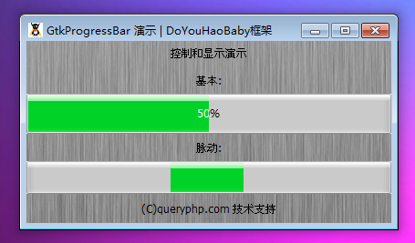

GtkProgressBar 是一个为显示不断增加或则不断移动的元件。GtkProgressBar 通常用于显示长时间运行的操作的进度。它提供了一个可视化的进度条。GtkProgressBar 可以被用于两个不同的模式：百分比模式和活动模式。

当一个应用程序能够决定多少工作需要被执行（比如说从一个文件读取固定数量的字节），并且可以监测其执行进度，这个时候可以使用百分比模式的 GtkProgressBar，这样用户可以通过进度条看到工作越来越多地被完成。在这种模式下，应用程序需要调用set_fraction()方法来不断更新进度条。

当应用程序不知道有多少工作需要去做，这个时候可以使用活动模式的 GtkProgressBar，它可以显示不断来回移动的块。在这种模式下，应用程序需要调用pulse()来更新进度条。

这里有相当的灵活性来控制进度条的外观。提供了控制进度条的方向，和进步条一起的可选文本，和设置活动模式的步长。

当你使用pulse()或者set_fraction()后进度条并没有更新，但是仍然在主循环中。这意味着在一个长时间的操作中，你需要使用main_iteration()来让UI更新自己。

# 构造函数
~~~
GtkProgressBar ([GtkAdjustment adjustment]);  
~~~

创建一个新的精度条实例。

我们来一段测试程序，代码如下：
~~~
<?php          
if(!class_exists('gtk')){      
    die("php-gtk2 模块未安装 \r\n");  
}      
    
$label1=new GtkLabel('控制和显示演示');   
$label2=new GtkLabel('(C)queryphp.com 技术支持');   
  
// 创建一个新的进度条   
$normal = new GtkProgressBar();   
  
// 创建一个脉冲   
$pulsing = new GtkProgressBar();   
$pulsing->set_pulse_step(0.1);// 设置脉冲移动量   
  
$vbox1=new GtkVBox();   
$vbox1->add($label1);   
$vbox1->add(new GtkLabel('基本:'));   
$vbox1->add($normal);   
$vbox1->add(new GtkLabel('脉动:'));   
$vbox1->add($pulsing);   
$vbox1->add($label2);   
  
$window1=new GtkWindow();   
$oPixbuf=GdkPixbuf::new_from_file('big.jpg');// 为窗口创建背景   
list($oPixmap,)= $oPixbuf->render_pixmap_and_mask(255);   
$oStyle=$window1->get_style();   
$oStyle=$oStyle->copy();   
$oStyle->bg_pixmap[Gtk::STATE_NORMAL]=$oPixmap;   
$window1->set_style($oStyle);   
$window1->set_title('GtkProgressBar 演示 | DoYouHaoBaby框架');   
$window1->set_default_size(400,200);// 窗口大小   
$window1->add($vbox1);   
$window1->connect_simple('destroy',array('Gtk','main_quit'));   
  
function update(GtkProgressBar $normal, GtkProgressBar $pulsing) {   
    // 脉冲不会含有任何固定的值，所以需要调用此方法   
    $pulsing->pulse();   
  
    // 从0开始每次增加10%，到了110%的时候回到0，以此循环形成动画   
    $normal->set_fraction(   
        (($normal->get_fraction() * 10 + 1) % 11) / 10   
    );   
       
    // 设置进度条文字   
    $normal->set_text(   
        ($normal->get_fraction() * 100) . '%'   
    );   
  
    // 保持timeout运行   
    return true;   
}   
  
// 每200毫秒执行以此update函数   
Gtk::timeout_add(200, 'update', $normal, $pulsing);   
  
$window1->show_all();   
Gtk::main();
~~~  

程序运行效果如下：
