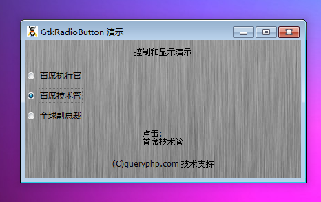

GtkRadioButton 是一个在一个分组中只能一个处于活动状态的按钮。

一个单选按钮使用和 GtkCheckButton一样的基本函数，因为它的位置的对象层次关系。仅仅当多个按钮被组织在一起，这样在各自的权利范围内才能够呈现不同的用户界面结构。

每一个单选按钮都是一个单选按钮组的成员。当一个分组中其中一个按钮被选择，那么其它的按钮将会处于非选择状态。一个 GtkRadioButton是一个让用户从一堆选择中选择。

可以使用 new GtkRadioButton()来创建新的单选按钮，如果是一个分组中第一个按钮，你只需要传递一个null给第一个参数。

你可以使用 get_group()获取GtkRatioButton 的分组。

为了将一个 GtkRadioButton 从一个分组移动到新的分组，可以使用set_group()。

# 构造函数
~~~
GtkRadioButton ([GtkRadioButton group [, string text [, bool use_underline = true]]]);  
~~~

# 创建一个新的单选按钮。

最后我们以一个测试程序结束本节教程，代码如下：
~~~
<?php       
if(!class_exists('gtk')){       
   die("php-gtk2 模块未安装 \r\n");   
}   
  
$label1=new GtkLabel('控制和显示演示');   
$label2=new GtkLabel('(C)queryphp.com 技术支持');   
  
$box = new GtkVBox();   
  
$label = new GtkLabel("点击按钮\n");   
$box->pack_end($label);   
  
$radio = null;   
foreach (array('首席执行官', '首席技术管', '全球副总裁') as $strLabel) {   
    $radio = new GtkRadioButton($radio, $strLabel, true);   
    $box->pack_start($radio);   
    $radio->connect('toggled', 'onToggle', $label);   
}   
  
function onToggle($radio, $label){   
    $label->set_text("点击:\n" . $radio->get_label());   
}   
  
$vbox1=new GtkVBox();   
$vbox1->add($label1);   
$vbox1->add($box);   
$vbox1->add($label2);   
  
$window1=new GtkWindow();   
$oPixbuf=GdkPixbuf::new_from_file('big.jpg');// 为窗口创建背景   
list($oPixmap,)= $oPixbuf->render_pixmap_and_mask(255);   
$oStyle=$window1->get_style();   
$oStyle=$oStyle->copy();   
$oStyle->bg_pixmap[Gtk::STATE_NORMAL]=$oPixmap;   
$window1->set_style($oStyle);   
$window1->set_title('GtkRadioButton 演示');   
$window1->set_default_size(400,200);// 窗口大小   
$window1->add($vbox1);   
$window1->connect_simple('destroy',array('Gtk','main_quit'));   
$window1->show_all();   
Gtk::main();  
~~~

程序运行效果如下图：
