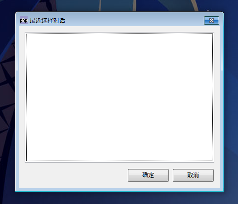

GtkRecentChooserDialog是一个最近选择对话框，这个对话框目前有bug,这里暂时轻描淡写。

我们写一段代码来测试一下，代码如下：
~~~
<?php   
if(!class_exists('gtk')){   
	die("php-gtk2 模块未安装\r\n");   
}   
  
$recentchooserdialog1=new GtkRecentChooserDialog();   
$recentchooserdialog1->connect_simple('destroy',array('Gtk','main_quit'));   
$recentchooserdialog1->set_position(Gtk::WIN_POS_CENTER_ON_PARENT);   
$recentchooserdialog1->set_type_hint(Gdk::WINDOW_TYPE_HINT_DIALOG);   
$recentchooserdialog1->set_has_separator(false);   
$recentchooserdialog1->set_title('最近选择对话');   
$recentchooserdialog1->add_button('确定',Gtk::RESPONSE_OK);   
$recentchooserdialog1->add_button('取消',Gtk::RESPONSE_CANCEL);   
$recentchooserdialog1->show_all();   
  
Gtk::main();   
  
?>  
~~~
程序运行效果如下：

说明：PHP-GTK 2.0.1版本目前对于这个类支持有bug，可以看到如下的警告：
Gtk-WARNING **: Could not find the icon 'application-x-glade'.
The 'hicolor' themewas not found either, perhaps you need to install it.
You can get a copy from:
http://icon-theme.freedesktop.org/releasesGtkRecentChooserDialog