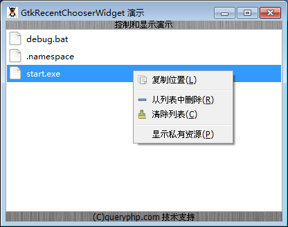

GtkRecentChooserWidget 是一个记录最近选择文件的元件。

我们来测试一段代码结束，代码如下：
~~~
<?php          
if(!class_exists('gtk')){      
    die("php-gtk2 模块未安装 \r\n");     
}      
    
$label1=new GtkLabel('控制和显示演示');   
$label2=new GtkLabel('(C)queryphp.com 技术支持');   
  
$recentchooser= new GtkRecentChooserWidget();   
  
$vbox1=new GtkVBox();   
$vbox1->add($label1);   
$vbox1->add($recentchooser);   
$vbox1->add($label2);   
  
$window1=new GtkWindow();   
$oPixbuf=GdkPixbuf::new_from_file('big.jpg');// 为窗口创建背景   
list($oPixmap,)= $oPixbuf->render_pixmap_and_mask(255);   
$oStyle=$window1->get_style();   
$oStyle=$oStyle->copy();   
$oStyle->bg_pixmap[Gtk::STATE_NORMAL]=$oPixmap;   
$window1->set_style($oStyle);   
$window1->set_title('GtkRecentChooserWidget 演示');   
$window1->set_default_size(400,200);// 窗口大小   
$window1->add($vbox1);   
$window1->connect_simple('destroy',array('Gtk','main_quit'));   
$window1->show_all();   
Gtk::main(); 
~~~ 

程序运行效果如下：

## 警告：你也许会收到如下的警告（意思没有找到Glade格式文件对应的图标）：
> (php.exe:7796): Gtk-WARNING **: Could not find the icon 'application-x-glade'. T
> he 'hicolor' theme
> was not found either, perhaps you need to install it.
> You can get a copy from:
>         http://icon-theme.freedesktop.org/releases