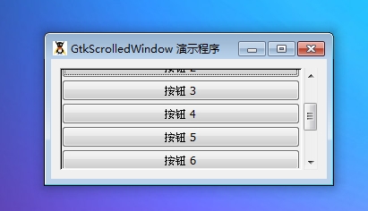

GtkScrolledWindow 是一个用于显示所有和部分子元件在一个可以滚动的窗口。

GtkScrolledWindow 是 GtkBin的子类：它是一个容器只接受一个子元件。GtkScrolledWindow 添加滚动条到子元件和拖出一条带有斜边的框架包围子元件。

滚动窗口可以在两个方面起效果。有些元件有自己的滚动支持，这些有很多适合 GtkAdjustment对象的“插槽”。自己带有滚动支持元件包括GtkTreeView,GtkTextView 和 GtkLayout。

对于那些缺乏滚动支持元件，GtkViewport像适配接头一样地工作，缺乏自己滚动功能的子元件可以从它这里继承滚动功能。使用 GtkViewport滚动的子元件比如GtkTable,GtkBox等等。

如果一个元件拥有自己的功能功能，我们可以使用add()将它添加至 GtkScrolledWindow 中。如果一个元件没有这样的功能，你必须首先将元件添加至GtkViewport 中，接着将GtkViewport添加到滚动窗口。最便捷地方法add_with_viewport()就是做这个的，所以你可以忽略viewport视口的存在。

滚动条的位置由滚动调节来控制。你可以查看 GtkAdjustment来获取调节字段。对于 GtkScrolledWindow 中使用 GtkScrollbar，它的值字段代表着滚动条的位置，同时这个值只能在最低值和最大值之间。page_size字段代表着滚动条可见区域的尺寸。step_increment和page_increment字段在当用户要求下滑（使用一个小的stepper方向键）或者向上（使用PageDown键）。

如果 GtkScrolledWindow 不像你预想的那样，或者没有处于右边布局，这非常重要使用 GtkScrollbar 设置你自己的滚动和比如说 GtkTable。

# 构造函数
~~~
GtkScrolledWindow ([ GtkAdjustment hadjustment = null [, GtkAdjustment vadjustment = null ]]);  
~~~

创建一个新的滚动窗口。这两个参数是滚动窗口的调节器。这些特性将会被滚动条和子元件分享来保持条和子元件同步。

通常来说你希望传递null给将会引起滚动窗口为你创建的调节器。

最后以一个演示程序结束本节教程，代码如下：
~~~
<?php       
if(!class_exists('gtk')){       
    die("php-gtk2 模块未安装 \r\n");  
}   
  
$scrwnd = new GtkScrolledWindow();   
$scrwnd->set_policy(Gtk::POLICY_AUTOMATIC, Gtk::POLICY_AUTOMATIC);   
$scrwnd->set_border_width(10);   
  
$vbox = new GtkVBox();   
for ($i = 0; $i < 10; $i++) {   
    $vbox->pack_start(new GtkButton('按钮 ' . $i));   
}   
  
$scrwnd->add_with_viewport($vbox);   
  
$wnd = new GtkWindow();   
$wnd->set_title('GtkScrolledWindow 演示程序');   
$wnd->connect_simple('destroy', array('Gtk', 'main_quit'));   
$wnd->add($scrwnd);   
$wnd->show_all();   
Gtk::main();  
~~~

程序运行效果如下图：
