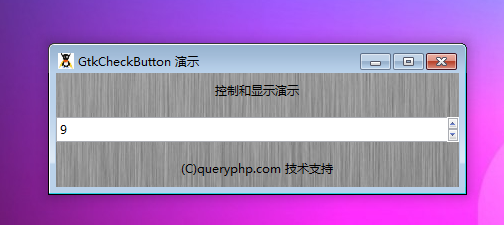

GtkSpinButton 是一个在给定的范围内变化的数字输入文本域。

# 构造函数
~~~
GtkSpinButton ([GtkAdjustment adjustment = null [, double climb_rate = 0.0, int digits]]);  
~~~

# 创建一个新的 GtkSpinButton对象实例。
~~~
GtkSpinButton::new_with_range (double min, double max, double step);   
~~~

同上，这里只能静态调用。

最后我们以一个测试程序结束本节教程，代码如下：
~~~
<?php       
if(!class_exists('gtk')){       
   die("php-gtk2 模块未安装 \r\n");       
}   
  
$label1=new GtkLabel('控制和显示演示');   
$label2=new GtkLabel('(C)queryphp.com 技术支持');   
  
$spinbutton1= new GtkSpinButton();   
$spinbutton1->set_increments(2,0);   
$spinbutton1->set_range(1,10);   
// 等效代码为 $spinbutton1=GtkSpinButton::new_with_range (1,10,2);   
  
$vbox1=new GtkVBox();   
$vbox1->add($label1);   
$vbox1->add($spinbutton1);   
$vbox1->add($label2);   
  
$window1=new GtkWindow();   
$oPixbuf=GdkPixbuf::new_from_file('big.jpg');// 为窗口创建背景   
list($oPixmap,)= $oPixbuf->render_pixmap_and_mask(255);   
$oStyle=$window1->get_style();   
$oStyle=$oStyle->copy();   
$oStyle->bg_pixmap[Gtk::STATE_NORMAL]=$oPixmap;   
$window1->set_style($oStyle);   
$window1->set_title('GtkCheckButton 演示');   
$window1->set_default_size(400,200);// 窗口大小   
$window1->add($vbox1);   
$window1->connect_simple('destroy',array('Gtk','main_quit'));   
$window1->show_all();   
Gtk::main();
~~~  

程序运行效果如下图：
