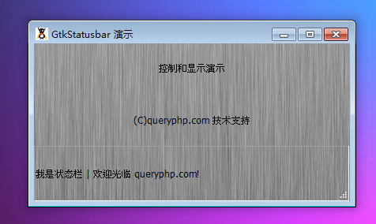

GtkStatusbar 是一个用于显示状态信息的元件。状态栏通常用于显示应用程序的状态或者一些其它随着时间变化的属性。通常情况下，状态栏显示在应用程序的主窗口的底部，并通知用户一些重要的过程已完成，如传输文件到远程服务器。

GtkStatusbar 维护一个错误消息的堆栈。堆栈顶部的消息是将要显示的消息。当顶部的消息弹出堆栈，它下面的消息将显示在状态栏中。

# 构造函数
~~~
GtkStatusbar ();  
~~~

创建一个新的 GtkStatusbar。新的状态栏会有一个空的消息堆栈。使用push()来增加新的消息。

我们来一段测试程序，代码如下：
~~~
<?php          
if(!class_exists('gtk')){      
    die("php-gtk2 模块未安装 \r\n"); 
}      
    
$label1=new GtkLabel('控制和显示演示');   
$label2=new GtkLabel('(C)queryphp.com 技术支持');   
  
$status = new GtkStatusbar();   
$context_id = $status->get_context_id('example');   
$status->push($context_id, '我是状态栏 | 欢迎光临 queryphp.com!');   
  
$vbox1=new GtkVBox();   
$vbox1->add($label1);   
$vbox1->add($label2);   
$vbox1->add($status);   
  
$window1=new GtkWindow();   
$oPixbuf=GdkPixbuf::new_from_file('big.jpg');// 为窗口创建背景   
list($oPixmap,)= $oPixbuf->render_pixmap_and_mask(255);   
$oStyle=$window1->get_style();   
$oStyle=$oStyle->copy();   
$oStyle->bg_pixmap[Gtk::STATE_NORMAL]=$oPixmap;   
$window1->set_style($oStyle);   
$window1->set_title('GtkStatusbar 演示');   
$window1->set_default_size(400,200);// 窗口大小   
$window1->add($vbox1);   
$window1->connect_simple('destroy',array('Gtk','main_quit'));   
$window1->show_all();   
Gtk::main(); 
~~~ 

程序运行效果如下：
