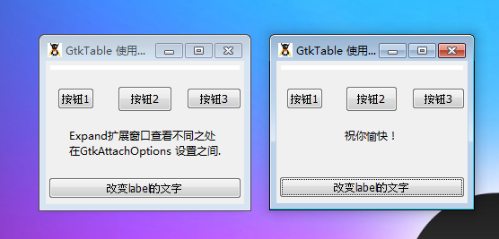

GtkTable 是一个提供简单的办法将许多的元件排列在同一个窗口中的容器，包含水平和垂直两个方向。尽管GtkFixed相似，但它可以通过定义行数和列的数量来更加简单去使用和允许相对的位置。生成的结果单元和GtkBox拥有相似的结构，每一个单元格只能拥有一个子元素，尽管子元素可以被放置在多个行和多个列。

我们主要通过attach()方法将元件添加至GtkTable中，它提供了大量的控制将元素放置在GtkTable中去。方法attachdefaults()和add()的关注度稍微少些。你可以使用remove()方法来从GtkTable中移除元件。

我们可以通过继承至GtkContainer的getchildren()方法获取子元件。它返回容器中的子元件列表。

同时参考： **GtkVBox, GtkHBox, GtkFixed.**

构造函数
~~~
GtkTable ([int n_rows = 1 [, int n_columns = 1 [, bool homogeneous = false]]]);   
~~~

构造器中的最开始的两个元素（n_rows，n_columns）定义了GtkTable表格的大小和单元格的数量。它们是随意的，GtkTable将会根据给定的子元素信息设置布局，如果必要它将是自动的。

最后一个元素（homogeneous）也是随意的，它关系着GtkTable去管理它子元素的尺寸。如果设置为true（默认值为false）,所有子元件拥有相同的高度和宽度。

attach()方法拥有很多的参数，一共9个，其中4个是随意的。基本上来说，如果homogeneous参数在构造函数中被设置为true,在绝大多数时间里使用4个随意参数中的任何一个都不会有多大的影响。当子元素不够组成空间的数量，它们自己形成自己。

好了，我们通过如下的代码来演示一下效果：
~~~
<?php       
if(!class_exists('gtk')){       
	die("php-gtk2 模块未安装 \r\n");  
}   
  
// 创建窗口   
$window = new GtkWindow();   
$window->set_title("GtkTable 使用示例");   
$window->set_position(Gtk::WIN_POS_CENTER);   
$window->connect_simple('destroy', array('Gtk', 'main_quit'));   
  
// 创建GtkTable   
$table = new GtkTable(3, 3, false);   
$table->set_row_spacings(10);   
$table->set_col_spacings(10);   
$window->add($table);   
  
// GtkTextView   
$text = new GtkTextView();   
$table->attach($text, 0, 3, 0, 1);   
  
$button1 = new GtkButton('按钮1');   
$table->attach($button1, 0, 1, 1, 2, Gtk::SHRINK, Gtk::SHRINK, 3, 3);   
  
$button2 = new GtkButton('按钮2');   
$table->attach($button2, 1, 2, 1, 2, Gtk::FILL, Gtk::FILL, 3, 3);   
  
$button3 = new GtkButton('按钮3');   
$table->attach($button3, 2, 3, 1, 2, Gtk::FILL, Gtk::EXPAND, 3, 3);   
  
// GtkLabel   
$label = new GtkLabel(   
    "Expand扩展窗口查看不同之处\r\n"  
    . "在GtkAttachOptions 设置之间."  
);   
$table->attach($label, 0, 3, 2, 3, Gtk::SHRINK, Gtk::SHRINK);   
  
$button4 = new GtkButton('改变label的文字');   
  
$table->attach($button4, 0, 3, 3, 4, Gtk::FILL, Gtk::EXPAND, 3, 3);   
$button4->connect_simple('clicked', 'change_text');   
  
function change_text(){   
    global $table;   
    $children = $table->get_children();   
    foreach($children as $key => $var) {   
        echo $var->get_name()."\n";   
    }   
    echo "\n";   
    $current_text = $children['1']->get_text();   
    if (substr($current_text, 0, 6) == "Expand") {   
        $children['1']->set_text("祝你愉快！\r\n");   
    } else {   
        $children['1']->set_text(   
              "Expand扩展窗口查看不同之处\r\n"  . "在GtkAttachOptions 设置之间."  
        );   
    }   
}   
  
$window->show_all();   
Gtk::main();   
~~~

程序运行效果如下图所示：
