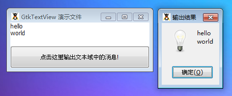

GtkTextView 是一个可以显示和编辑的大块本文域，这个跟Web里面的Textarea 是一样的。

# 构造函数
~~~
GtkTextView ();   
~~~

# 创建一个新的GtkTextView 对象实例
~~~
GtkTextView::new_with_buffer ([GtkTextBuffer buffer = null]);   
~~~

创建一个带有 GtkTextBuffer 的对象实例。

最后我们以一个测试程序结束本节教程，代码如下：
~~~
<?php       
if(!class_exists('gtk')){       
    die("php-gtk2 模块未安装 \r\n"); 
}   
  
function get_input($entry) {   
    $input = $entry->get_buffer()->get_text($entry->get_buffer()->get_start_iter(),$entry->get_buffer()->get_end_iter());   
    $dialog = new GtkMessageDialog($wnd, Gtk::DIALOG_MODAL,Gtk::MESSAGE_INFO, Gtk::BUTTONS_OK, $errors);   
    $dialog->set_markup("$input\r\n");      
    $dialog->set_title('输出结果');   
    $dialog->run();      
    $dialog->destroy();   
    $entry->get_buffer()->set_text("");   
}   
  
$window = new GtkWindow();   
$window->set_title('GtkTextView 演示文件');   
$window->set_position(Gtk::WIN_POS_CENTER);   
$window->set_default_size(300,80);   
$window->connect_simple('destroy', array('Gtk', 'main_quit'));   
  
$box = new GtkVBox();   
$window->add($box);   
  
$entry = new GtkTextView();   
$box->add($entry);   
  
$button = new GtkButton('点击这里输出文本域中的消息!');   
$button->connect_simple('clicked', 'get_input', $entry);   
$box->add($button);   
  
$window->show_all();   
Gtk::main();
~~~  

程序运行效果如下图：
