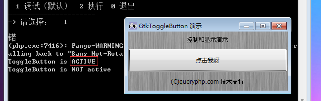

GtkToggleButton 是一个当被点击后处于'pressed-in'按着状态的 GtkButton。当再次点击它又会回到最初的状态。

GtkToggleButton 的样式可以通过 set_active来设置，通过get_active()返回。

可以使用toggled()方法切换双态按钮的状态。

# 构造函数
~~~
GtkToggleButton ([string label [, boolean use_underline = true]]);  
~~~

创建一个新的带有文字的按钮. 如果第二个参数为false,那么助记符(_)将不会有效果。

最后我们以一个测试程序结束本节教程，代码如下：
~~~
<?php       
if(!class_exists('gtk')){       
    die("php-gtk2 模块未安装 \r\n");   
}   
  
$label1=new GtkLabel('控制和显示演示');   
$label2=new GtkLabel('(C)queryphp.com 技术支持');   
  
$togglebtn = new GtkToggleButton('点击我呀');   
$togglebtn->connect('toggled', 'toggled');   
  
function toggled($togglebtn) {   
    if ($togglebtn->get_active()) {   
        echo "ToggleButton is ACTIVE\r\n";   
    } else {   
        echo "ToggleButton is NOT active\r\n";   
    }   
}   
  
$vbox1=new GtkVBox();   
$vbox1->add($label1);   
$vbox1->add($togglebtn);   
$vbox1->add($label2);   
  
$window1=new GtkWindow();   
$oPixbuf=GdkPixbuf::new_from_file('big.jpg');// 为窗口创建背景   
list($oPixmap,)= $oPixbuf->render_pixmap_and_mask(255);   
$oStyle=$window1->get_style();   
$oStyle=$oStyle->copy();   
$oStyle->bg_pixmap[Gtk::STATE_NORMAL]=$oPixmap;   
$window1->set_style($oStyle);   
$window1->set_title('GtkToggleButton 演示');   
$window1->set_default_size(400,200);// 窗口大小   
$window1->add($vbox1);   
$window1->connect_simple('destroy',array('Gtk','main_quit'));   
$window1->show_all();   
Gtk::main();
~~~  

程序运行效果如下图：
