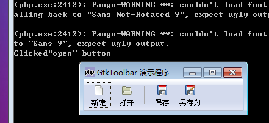

GtkToolbar 是一个显示 GtkToolItems 的元件，它可以显示按钮，下拉菜单和其它元件在一排上。这些元件只能是 GtkToolItem 的子类，我们可以使用 insert()方法将元件添加至toolbar里面和remove()方法将元件删除。

你可以使用 GtkSeparatorToolItem 将toolbar上的项目进行分割成组。如果expand设置为true,draw设置为false,它将会让所有后继的项依次添加至toolbar的后面。

如果你获取到一个像这样的警告：
> Gtk-WARNING **: Mixing deprecated and non-deprecated GtkToolbar API is not allowed remember that insert() is the only valid method to additems.

所有其它 prepend_*，append_*和insert_* 都是弃用的方法。

# 构造函数
~~~
GtkToolbar ();  
~~~

创建一个新的空toolbar元件，子项可以通过insert()添加至toolbar,而且所有子元素子只能是GtkToolItem 的子类。

最后，我们以一个演示程序结束本节教程，代码如下：
~~~
<?php       
if(!class_exists('gtk')){       
    die("php-gtk2 模块未安装 \r\n");  
}   
  
// 创建GtkToolbar   
$tb = new GtkToolbar();   
  
// 设置GtkToolbar根据需要获取空格   
$tb->set_show_arrow(false);   
  
// “NEW” 按钮   
$new    = GtkToolButton::new_from_stock(Gtk::STOCK_NEW);   
$new->connect_simple('clicked', 'onClickedToolButton', 'new');   
$tb->insert($new, -1);// 1意味着GtkToolbar尾部   
  
// "open" 按钮   
$open   = GtkToolButton::new_from_stock(Gtk::STOCK_OPEN);   
$open->connect_simple('clicked', 'onClickedToolButton', 'open');   
$tb->insert($open, -1);   
  
// 设置一个分割线   
$tb->insert(new GtkSeparatorToolItem(), -1);   
  
// 第三个按钮   
$save   = GtkToolButton::new_from_stock(Gtk::STOCK_SAVE);   
$save->connect_simple('clicked', 'onClickedToolButton', 'save');   
$tb->insert($save, -1);   
  
// 最后一个菜单   
$saveas = GtkToolButton::new_from_stock(Gtk::STOCK_SAVE_AS);   
$saveas->connect_simple('clicked', 'onClickedToolButton', 'saveas');   
$tb->insert($saveas, -1);   
  
function onClickedToolButton($action){   
    echo 'Clicked"' . $action . '" button' . "\r\n";   
}   
  
$window = new GtkWindow();   
$window->set_title('GtkToolbar 演示程序');   
$window->add($tb);   
$window->connect_simple('destroy', array('Gtk', 'main_quit'));   
$window->show_all();   
Gtk::main(); 
~~~ 

程序运行效果如下图：
