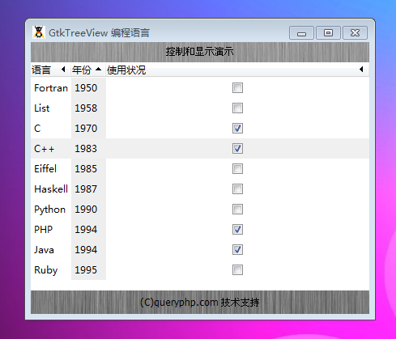

GtkTreeView 是一个用于显示树和列表的元件。要显示一个列表，可以通过通过构造函数或者set_model()来设置一个 GtkListStore。对于树，使用一个 GtkTreeStore对象，基本上任何实现了
GtkTreeModel借口的类都是合适的。

在创建了视图和设置了模型后，你需要创建一些 GtkTreeViewColumns和通过append_column()将它们添加到视图。列元件本身需要一些 GtkCellRenderers，它们实质上用来绘制和显示模型数据。

为了获得视图中选择的行，你可以使用get_selection()来获取视图的管理选择的 GtkTreeSelection对象。如果你要跟踪变化，你只需要连接“changed”信号。

# 构造函数
~~~
GtkTreeView ([GtkTreeModel model]);  
~~~

创建一个新的 带有一些数据项的 GtkTreeView。如果你没有通过构造函数设置，那么这个时候你看恶意通过set_model()来设置。

我们来一段测试程序，代码如下：
~~~
<?php          
if(!class_exists('gtk')){      
    die("php-gtk2 模块未安装 \r\n");     
}      
    
$label1=new GtkLabel('控制和显示演示');   
$label2=new GtkLabel('(C)queryphp.com 技术支持');   
  
// 模型   
$store = new GtkListStore(GObject::TYPE_BOOLEAN, GObject::TYPE_STRING, GObject::TYPE_LONG);   
  
// 模型中的数据   
$store->append(array(true , 'PHP'    , 1994));   
$store->append(array(true , 'C'      , 1970));   
$store->append(array(true , 'C++'    , 1983));   
$store->append(array(false, 'Ruby'   , 1995));   
$store->append(array(false, 'Python' , 1990));   
$store->append(array(true , 'Java'   , 1994));   
$store->append(array(false, 'Fortran', 1950));   
$store->append(array(false, 'List'   , 1958));   
$store->append(array(false, 'Haskell', 1987));   
$store->append(array(false, 'Eiffel' , 1985));   
  
// 按年升序排列   
$store->set_sort_column_id(2, Gtk::SORT_ASCENDING);   
  
// 通过 GtkTreeView 显示模型中的数据   
$treeview = new GtkTreeView($store);   
  
$cell_renderer = new GtkCellRendererText();   
  
$colLanguage = new GtkTreeViewColumn('语言', $cell_renderer, 'text', 1);   
$colLanguage->set_resizable(true);   
$colLanguage->set_sort_column_id(1);   
$treeview->append_column($colLanguage);   
  
$colYear = new GtkTreeViewColumn('年份', $cell_renderer, 'text', 2);   
$colYear->set_sort_column_id(2);   
$treeview->append_column($colYear);   
  
$bool_cell_renderer = new GtkCellRendererToggle();   
$colUsed = new GtkTreeViewColumn('使用状况', $bool_cell_renderer, 'active', 0);   
$colUsed->set_sort_column_id(0);   
$treeview->append_column($colUsed);   
  
$vbox1=new GtkVBox();   
$vbox1->add($label1);   
$vbox1->add($treeview);   
$vbox1->add($label2);   
  
$window1=new GtkWindow();   
$oPixbuf=GdkPixbuf::new_from_file('big.jpg');// 为窗口创建背景   
list($oPixmap,)= $oPixbuf->render_pixmap_and_mask(255);   
$oStyle=$window1->get_style();   
$oStyle=$oStyle->copy();   
$oStyle->bg_pixmap[Gtk::STATE_NORMAL]=$oPixmap;   
$window1->set_style($oStyle);   
$window1->set_title('GtkTreeView 编程语言');   
$window1->set_default_size(400,200);// 窗口大小   
$window1->add($vbox1);   
$window1->connect_simple('destroy',array('Gtk','main_quit'));   
$window1->show_all();   
Gtk::main();  
~~~

程序运行效果如下：
