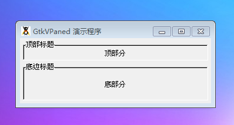

GtkVPaned 是一个由两个垂直分割的窗格的容器。两个窗格之间的部分通过一个可拖动的句柄是可以调整的。

# 构造函数
~~~
GtkVPaned ();  
~~~

创建一个新的窗格。

我们最后一个测试代码结束本教程，代码如下：
~~~
<?php       
if(!class_exists('gtk')){       
    die("php-gtk2 模块未安装 \r\n");      
}   
  
$vpane = new GtkVPaned();   
$vpane->set_border_width(5);   
  
$top = new GtkFrame('顶部标题');   
$top->add(new GtkLabel('顶部分'));   
$top->set_shadow_type(Gtk::SHADOW_IN);   
$vpane->add1($top);   
  
$bottom = new GtkFrame('底边标题');   
$bottom->add(new GtkLabel('底部分'));   
$bottom->set_shadow_type(Gtk::SHADOW_IN);   
$vpane->add2($bottom);   
  
// 创建GtkWindow窗口   
$wnd = new GtkWindow();   
$wnd->set_title('GtkVPaned 演示程序');   
$wnd->set_default_size(300,-1);   
$wnd->connect_simple('destroy', array('Gtk', 'main_quit'));   
$wnd->add($vpane);   
$wnd->show_all();   
Gtk::main();  
~~~

程序运行效果如下图：
