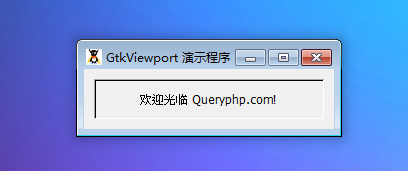

GtkViewport （视口）会为不支持滚动的元件添加滚动功能。比如说，GtkLabel或者GtkVBox可以被放进 GtkScrolledWindow中，但是这个类却不支持 “set-scroll-adjustmments”，使用滚动条将不会有效果。

一个视口同样会关心显示元件确定的部分，隐藏剩下的不在可见区域的部分。

# 构造函数
~~~
GtkViewport ([GtkAdjustment hadjustment = null [, GtkAdjustment vadjustment = null]]);  
~~~

创建一个新的视口。如果其中一个参数被省略或者为null,那么将会自动调整。在创建对象实例后，你应该使用 GtkContainer的add()方法来设置子元件。如果你计划将视口添加至 GtkScrolledWindow，这个时候你应该关注 add_with_viewport方法。

我们最后以一段测试程序结束，代码如下：
~~~
<?php       
if(!class_exists('gtk')){       
    die("php-gtk2 模块未安装 \r\n");      
}   
  
$label1=new GtkLabel();           
$label1->set_label("欢迎光临 Queryphp.com!");   
$label1->set_alignment(0.5, 0.5);           
$label1->set_padding(0, 0);   
  
$viewport1=new GtkViewport();   
$viewport1->add($label1);   
  
// 创建窗口   
$window = new GtkWindow();   
$window->connect('destroy', 'onDestroy');   
$window->set_title('GtkViewport 演示程序');   
$window->set_default_size(250, 60);   
$window->set_border_width(10);   
$window->add($viewport1);   
$window->show_all();   
Gtk::main(); 
~~~ 

程序运行效果如下图：
